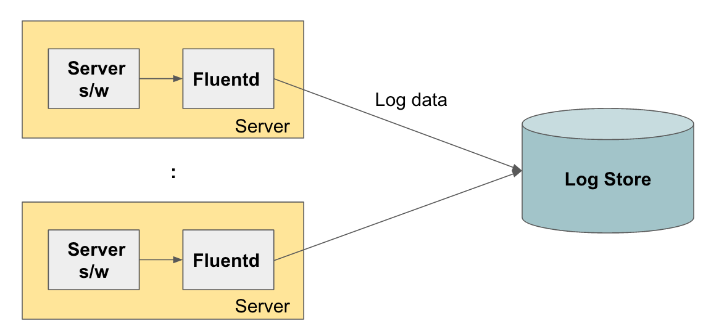
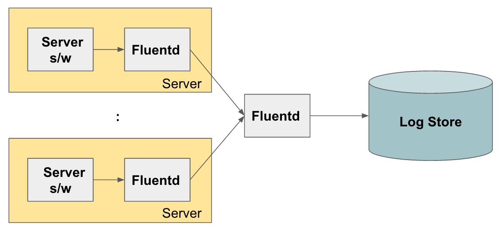
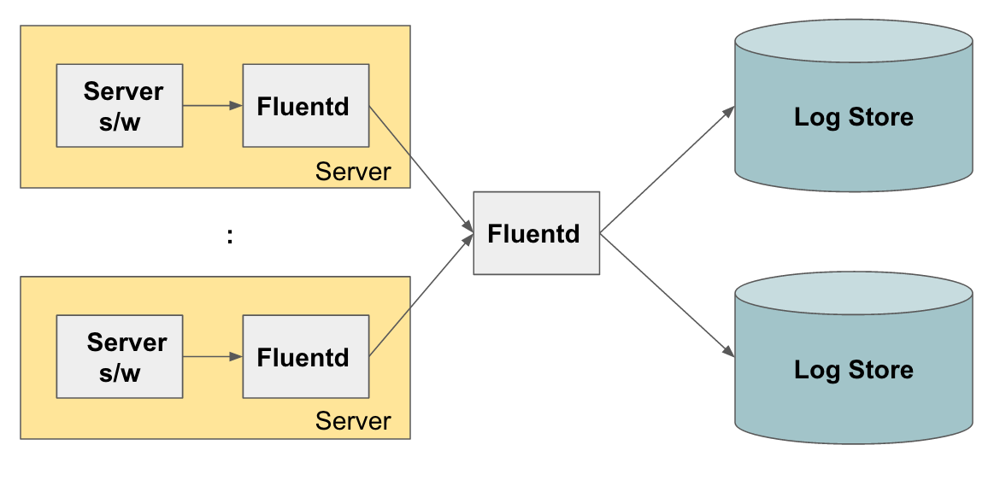
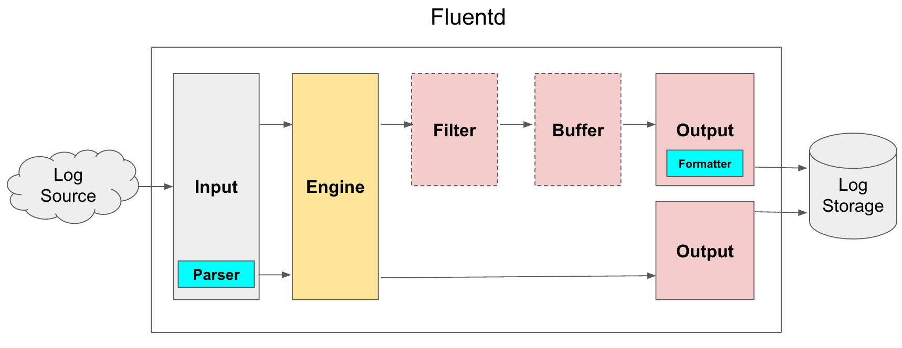

# fluentD (분산로그시스템)
#### 목차

### fluentD는 왜 사용할까?
하나의 서버 머신이 처리할 수 있는 요청은 한계가 있다. 그렇기때문에 대형 웹 서비스에서는 여러 대의 서버를 통해서 시스템을 운영하곤한다.
하지만 서버에 문제가 발생했을때, 어느 서버에서 문제가 생겼는지 확인하는 것은 쉽지 않다. 각 서버마다 로그가 각각 쌓이기때문에 로그를 통해서 무언가 분석을 하려면
각 서버로 접속해서 로그를 확인해야한다. 이런 수고를 덜어주기 위해서 각 서버에 파편화되어있는 로그를 모아주는 프로그램이 필요하게되었는데, 이 시스템이 분산 로그 수집기이다.
fluentD는 분산 시스템 환경에서 독립 어플리케이션들에서 발생하는 로그를 수집하고 필터링하여 재생산하는 시스템이다.

### fluentD는 어떻게 동작할까?

Fluentd의 로그 수집 아키텍쳐를 살펴보면 다음과 같다.

아래 그림과 같이 각 서버에, Fluentd를 설치하면, 서버에서 기동되고 있는 서버(또는 애플리케이션)에서 로그를 수집해서 중앙 로그 저장소 (Log Store)로 전송 하는 방식이다.

위의 그림은 가장 기본적인 구조로 Fluentd가 로그 수집 에이전트 역할만을 하는 구조인데, 이에 더해서 다음과 같이 각 서버에서 Fluentd에서 수집한 로그를 다른 Fluentd로 보내서 이 Fluentd가 최종적으로 로그 저장소에 저장하도록 할 수 도 있다.

중간에 fluentd를 넣는 이유는, 이 fluentd가 앞에서 들어오는 로그들을 수집해서 로그 저장소에 넣기 전에 로그 트래픽을 Throttling (속도 조절)을 해서 로그 저장소의 용량에 맞게 트래픽을 조정을 할 수 있다.

또는 다음 그림과 같이 로그를 여러개의 저장소에 복제해서 저장하거나 로그의 종류에 따라서 각각 다른 로그 저장소로 라우팅이 가능하다.

Fluentd를 이용해서 로그 수집 아키텍쳐를 구성하는 방법을 대략적으로 알아보았는데, 그렇다면 Fluentd 자체의 구조는 어떻게 되어 있을까?

Fluentd는 크게 다음 그림과 같이 Input,Parser,Engine,Filter,Buffer,Ouput,Formatter 7개의 컴포넌트로 구성이 된다.  7개의 컴포넌트중 Engine을 제외한 나머지 6개는 플러그인 형태로 제공이 되서 사용자가 설정이 가능하다.

일반적인 데이타 흐름은 Input → Engine → Output 의 흐름으로 이루어 지고,  Parser, Buffer, Filter, Formatter 등은 설정에 따라서 선택적으로 추가 또는 삭제할 수 있다.

#### Input
Input은 로그를 수집하는 플러그인으로, 다양한 로그 소스를 지원한다. HTTP, tail, TCP 등 기본 플러그인 이외에도, 확장 플러그인을 통해서 다양한 서버나 애플리케이션으로 부터 다양한 포맷의 데이타를 수집할 수 있도록 해준다.

#### Parser (Optional)
Input 플러그인을 통해서 데이타를 읽어도 데이타 포맷이 Fluentd에서 지원하지 않는 데이타 포맷인 경우가 있기 때문에, 이 데이타를 파싱 하기 위해서, Parser 플러그인을 선택적으로 사용할 수 있다. Regular expression  기반으로 스트링을 Parsing 하는 플러그인 뿐 아니라, apache, nginx, syslog등 다양한 포맷의 데이타를 파싱할 수 있는 플러그인을 제공한다.

#### Filter (Optional)
Filter 플러그인을 읽어드린 데이타를 output으로 보내기 전에, 다음과 같은 3가지 기능을 한다.

- 필터링
- 데이타 필드 추가
- 데이타 필드 삭제 또는 특정 필드 마스킹

필터링은 특정 데이타만 output 필드로 보내고, 나머지는 버리도록 한다. 예를 들어 로그 데이타에 “seoul”이라는 문자열이 있을 경우만 로그 서버로 보내거나 “error”, “warning”과 같은 특정 패턴이 있을 경우에만 로그 저장소로 보내도록할 수 있다.

데이타 필드 추가는 기존 들어온 로그 데이타에 데이타를 전송한 서버명 (Host명)등을 추가해서 로그 저장소로 보낼 수 있다.

마지막으로 데이타 필드 삭제는 불필요한 필드를 삭제하거나 개인 정보등 민감 정보를 삭제하거나 해쉬화하여 데이타 저장소로 보낼 수 있는 기능을 한다.

#### Output
Output은 Input 플러그인과 반대로, 앞에서 필터링된 데이타를  데이타 저장소 솔루션에 데이타를 저장하도록 한다. (mongodb나 AWS S3 , Google의 Big query등)

#### Formatter (Optional)
Output 플러그인을 통해서 데이타를 저장소에 쓸 때, Formatter 를 이용하면 쓰는 데이타의 포맷을 정의할 수 있다.(cf. Input의 parser가 포맷에 맞게 읽는 플러그인이라면, Formatter는 Output을 위한 포맷을 지정하는 플러그인이라고 보면 된다.)

#### Buffer (Optional)
Input에서 들어온 데이타를 바로 Output으로 보내서 쓰는것이 아니라 중간에 선택적으로 Buffer를 둬서 Throttling을 할 수 있다. 버퍼는 File과  Memory 두가지를 사용할 수 있다.

출처: http://bcho.tistory.com/1115 [조대협의 블로그]
