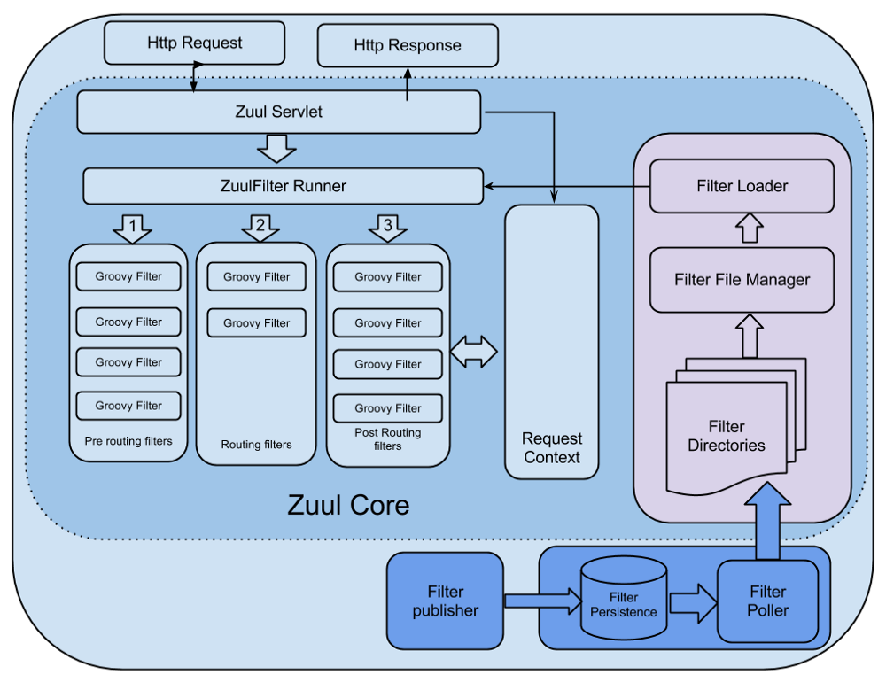
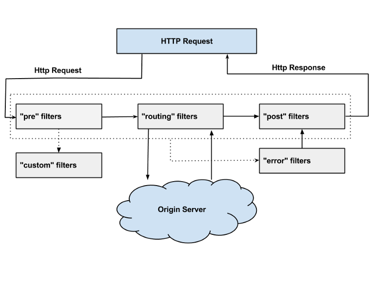

API Gateway: Zuul
====================================================================

## API GATEWAY이란?
Micro Service Architecture(이하 MSA)에서 언급되는 컴포넌트 중 하나이며, 모든 클라이언트 요청에 대한 end point를 통합하는 서버이다. 마치 프록시 서버처럼 동작한다. 그리고 인증 및 권한, 모니터링, logging 등 추가적인 기능이 있다. 모든 비지니스 로직이 하나의 서버에 존재하는 Monolithic Architecture와 달리 MSA는 도메인별 데이터를 저장하고 도메인별로 하나 이상의 서버가 따로 존재한다. 한 서비스에 한개 이상의 서버가 존재하기 때문에 이 서비스를 사용하는 클라이언트 입장에서는 다수의 end point가 생기게 되며, end point를 변경이 일어났을때, 관리하기가 힘들다. 그래서 MSA 환경에서 서비스에 대한 도메인인 하나로 통합할 수 있는 API GATEWAY가 필요한 것이다.

Zuul은 Netflix에서 만든 API Gateway 오픈소스로 Java 프로젝트이다. 다른 오픈소스로는 KONG, API Umbrella, tyk.io 등이 있다.

## Zuul
Zuul은 넷플릭스에서 만든 API Gateway로 그루비로 작성되었으며 filter 개념을 통해서 API Gateway에 추가 기능을 넣고 관리할 수 있다.

Zuul은 Filter를 통해서 다음과 같은 기능을 구현하고있다.
- Authentication and Security : 클라이언트 요청시, 각 리소스에 대한 인증 요구 사항을 식별하고 이를 만족시키지 않는 요청은 거부
- Insights and Monitoring : 의미있는 데이터 및 통계 제공
- Dynamic Routing : 필요에 따라 요청을 다른 클러스터로 동적으로 라우팅
- Stress Testing : 성능 측정을 위해 점차적으로 클러스터 트래픽을 증가
- Load Shedding : 각 유형의 요청에 대해 용량을 할당하고, 초과하는 요청은 제한
- Static Response handling : 클러스터에서 오는 응답을 대신하여 API GATEWAY에서 응답 처리


출처 - https://medium.com/netflix-techblog/announcing-zuul-edge-service-in-the-cloud-ab3af5be08ee

위는 Zuul 아키텍처를 나타내는 그림이다.

- Filter File Manager에서는 일정 주기(정해진 시간) 마다 정해진 directory에서 groovy로 정의된 filter 파일을 가져온다.
- ZuulServlet은 HttpServlet을 재정의 하였다.
- Request 요청이 들어 올때마다 아래와 같이 preRoute(), route(), postRoute()에서 ZuulFilter Runner를 실행한다.
- 각 단계에서 Filter들은 비동기로 실행되며 통신을 위해서 RequestContext를 공유한다.
- ZuulFilter Runner는 Filter에 정의된 기능을 실행한다.

```Java
@Override
public void service(javax.servlet.ServletRequest servletRequest, javax.servlet.ServletResponse servletResponse) throws ServletException, IOException {
    try {
        init((HttpServletRequest) servletRequest, (HttpServletResponse) servletResponse);

        // Marks this request as having passed through the "Zuul engine", as opposed to servlets
        // explicitly bound in web.xml, for which requests will not have the same data attached
        RequestContext context = RequestContext.getCurrentContext();
        context.setZuulEngineRan();

        try {
            preRoute();
        } catch (ZuulException e) {
            error(e);
            postRoute();
            return;
        }
        try {
            route();
        } catch (ZuulException e) {
            error(e);
            postRoute();
            return;
        }
        try {
            postRoute();
        } catch (ZuulException e) {
            error(e);
            return;
        }

    } catch (Throwable e) {
        error(new ZuulException(e, 500, "UNHANDLED_EXCEPTION_" + e.getClass().getName()));
    } finally {
        RequestContext.getCurrentContext().unset();
    }
}
```

### Zuul filter
Zuul은 필터를 통해서 API Gateway에 필요한 기능들을 추가하거나 관리할 수 있다.

각 리퀘스트는 네 가지 라이프사이클 흐름으로 처리되며 아래와 같이 네 가지 필터를 탄다.

- Pre Filter - 라우팅 전에 실행되는 필터, 인증과 로깅 기능은 주로 여기에 들어간다.
- Routing Filter - 요청에 대한 라우팅을 다루는 필터, Apache http client를 사용하여 정해진 Url로 보낼수 있고, Neflix Ribbon을 사용하여 동적으로 라우팅 할 수도 있다.
- Post Filter - 라우팅 후에 실행되는 필터, response에 HTTP header를 추가하거나, response에 대한 응답속도, Status Code, 등 응답에 대한 statistics and metrics을 수집한다.
- Error Filter - 에러 발생시 실행되는 필터, 필터 실행 후 Post Filter가 실행된다.



출처 - https://medium.com/netflix-techblog/announcing-zuul-edge-service-in-the-cloud-ab3af5be08ee


### Filter Interface
필터를 정의하려면 ZuulFilter를 상속받아서 아래 네 개의 메소드를 구현해야한다.

```java
String filterType();

int filterOrder();

boolean shouldFilter();

Object run();
```

#### To Run, or Maybe Not
shouldFilter는 해당 필터가 실행될 것인가에 대한 로직을 담는다. true를 리턴한다면 필터가 실행된다.

#### Ordering
filterOrder는 같은 Type에서 실행되는 필터들과의 우선순위를 나타내는 int값을 리턴한다.

#### Filter Types
이 메소드는 필터 타입에 대한 String 값을 리턴한다.
Zuul에서 제공하는 기본 필터타입은 pre, routing, post, error이다. 이 밖에 필터 타입은 GroovyProcessor.runFilters를 직접 구현해서 추가할 수 있다.

#### Filter Coordination
run() 메소드는 이 필터가 어떤 작업을 하는지 정의한다.

다음은 ZuulFilter를 상속받아서 내부 IP에 대한 접근인지를 확인하는 필터 예제이다.

```Kotlin
class InternalCheckFilter : ZuulFilter() {

    private val internalIpRegex = Regex("(0:|127\\.|10\\.|172\\.|192\\.).*")


    override fun filterType() = 'pre'

    override fun filterOrder() = -1

    override fun shouldFilter(): Boolean {
        val uri = RequestContext.getCurrentContext().request.requestURI ?: ""
        return (uri.contains("/internal") || uri.contains("/universal"))
    }

    override fun run(): Any? {
        val ctx = RequestContext.getCurrentContext()
        val request = ctx.request
        val ip = request.remoteAddr

        if (!isInternalIp(ip)) {
            ctx.setSendZuulResponse(false)
            ctx.responseStatusCode = HttpStatus.FORBIDDEN.value()
        }

        return null
    }

    fun isInternalIp(ip: String?): Boolean {
        return ip?.matches(internalIpRegex) ?: false
    }

}
```
