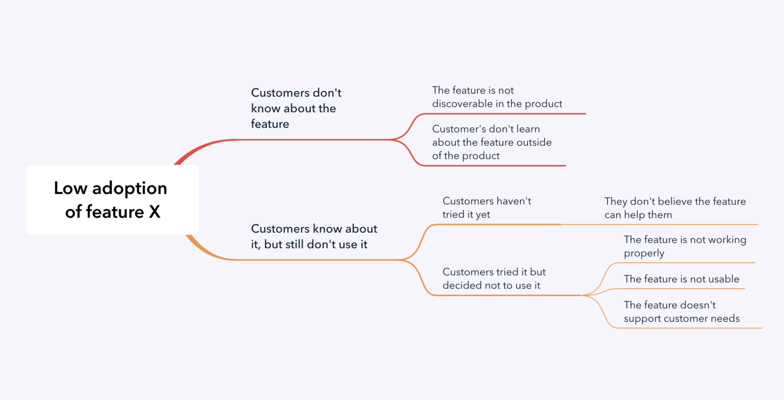

이슈 트리
==============================================================

문제를 구조적으로 생각하고 해결하기 위한 체계적인 방법

## 이슈 트리
- 이슈트리는 문제 해결을 위한 지도이다.
- 이슈트리를 통해서 문제를 보다 명확하고 체계적인 시각으로 바라볼 수 있다.
- 이슈트리를 이용하면 문제를 잘게 나누어 해결하기 쉬운 단위로 나누고 각 세부 문제별 우선 순위를 정할 수 있다. (분할정복 기법)
- 이슈트리로 문제를 정리하면 커뮤니케이션에서 이점을 취할 수 있다.

### 이슈 트리 종류

이슈 트리에는 두 가지 종류가 있습니다. 

- Problem Tree: 왜(why) 문제가 발생하는가에 집중하는 트리
- Solution Tree: 어떻게(how) 문제를 해결할 것인가에 집중하는 트리

### 이슈 트리 만들기

 좋은 이슈트리는 트리 노드에 모든 문제를 포함해야합니다. 좋은 트리를 만들기 위해 엄격하게 지켜야할 몇가지 원칙들이 있습니다. 

#### Problem Tree

1. 문제를 카테고리 별로 잘게 쪼갠다.
2. MECE 원칙을 지킨다. 
    - MECE(Mutually Exclusive Collectively Exhaustive의 약자, 상호배제와 전체포괄)는 항목들이 상호 배타적이면서 모였을 때는 완전히 전체를 이루는 것을 의미한다. 이를테면 '겹치지 않으면서 빠짐없이 나눈 것'이라 할 수 있다.
3. 디테일에 집착하지 않는다. 예컨데 특정 문제를 그 문제가 발생하는 가설과 함께 작성하지 않는다.
4. 80/20 원칙을 적용하라
    - 영향력이 큰 문제에 집중하고 가설보다는 데이터를 믿어라

#### Solution Tree

1. 중점을 두고자하는 문제의 부분을 취하여 "어떻게 개선 / 수정할 수 있습니까?"를 던져보자.

2. 솔루션의 잠재적 범주를 매핑

3. 각 범주 내에서 아이디어를 생성

### 실제 예

