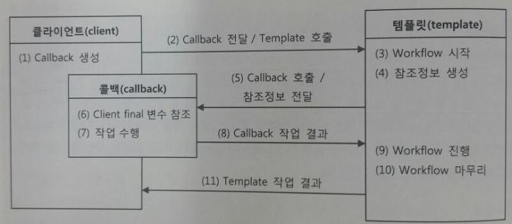

# 3.5 템플릿과 콜백
- 지금까지 전략패턴의 기본구조에 익명 내부 클래스를 활용하는 방식을 `템플릿/콜백` 패턴이라고 한다.
- 일정한 패턴의 작업 흐름이 존재하고 일부분만 자주 바꿔서 사용하는 경우에 적합하다.
- 전략 패턴의 컨텍스트를 `템플릿`이라 부르고, 명 내부 클래스로 만들어지는 부분을 `콜백`이라 부른다.

### 템플릿/콜백의 동작원리
##### 템플릿/콜백의 특징
- 여러 개의 메소드를 가진 일반적인 인터페이스를 사용할 수 있는 전략 패턴의 전략과 달리 템플릿/콜백 패턴의 콜백은 보통 단일 메소드 인터페이스를 사용한다. (템플릿의 작업 흐름 중 특정 기능을 위해 한번 호출되는 것이 일반적이기 때문)
- 하나의 템플릿에서 여러 전략이 필요하다면 콜백을 여러개 사용하게 된다.



- 조금 복잡해 보이지만 DI 방식의 전략 패턴 구조라고 생각하고 보면 간단하다.
- 클라이언트가 템플릿 메소드를 호출하면서 콜백 오브젝트를 전달하는 것은 메소드 레벨에서 일어나는 DI다.
- 일반적인 DI는 템플릿에 인스턴스 변수를 만들어두고 의존 오브젝트를 메소드로 받아서 사용하지만, 템플릿 콜백 방식에서는 매번 메소드 단위로 사용할 오브젝트를 새롭게 전달받는다는 것이 특징이다.


### 편리한 콜백의 재활용
- DAO 메소드에서 매번 익명 내부 클래스를 사용하기에 코드 작성과 읽기가 불편한 문제점을 해결해보자.

##### 콜백의 분리와 재활용
- 앞서 JDBC try/catch/finally 에 적용했던, 재사용 가능한 부분을 분리하는 방법을 적용해보자.

```java
//익명 내부 클래스를 사용한 클라이언트 코드
public void deleteAll() throws SQLException {
    this.jdbcContext.workWithStatementStrategy(
        //변하지 않는 콜백 클래스 정의와 오브젝트 생성
        new StatementStratrgy() {
            public PreparedStatement makePreparedStatement(Connection c) throws SQLException {
                return c.preparedStatement("delete from users"); //변하는 SQL 문장
            }
        }
    );
}
```

```java
//변하지 않는 부분을 분리시킨 deleteAll 메소드
public void deleteAll() throws SQLException {
    executeSql("delete from users"); //변하는 SQL 문장
}

private void executeSql(final String query) throws SQLException {
    this.jdbcContext.workWithStatementStrategy(
        //변하지 않는 콜백 클래스 정의와 오브젝트 생성
        new StatementStratrgy() {
            public PreparedStatement makePreparedStatement(Connection c) throws SQLException {
                return c.preparedStatement(query); //변하는 SQL 문장
            }
        }
    );
}
```

##### 콜백과 템플릿의 결합
- 한단계 더 나아가 executeSql 을 DAO가 공유하도록 템플릿 클래스 안으로 옮겨보자. 템플릿은 엄밀히 JdbcContext 클래스가 아니라 workWithStatementStrategy 메소드이므로 executeSql을 옮기는 것도 문제없다.

```java
public class JdbcContext {
    ...
    public void executeSql(final String query) throws SQLException {
        workWithStatementStrategy(
            //변하지 않는 콜백 클래스 정의와 오브젝트 생성
            new StatementStratrgy() {
                public PreparedStatement makePreparedStatement(Connection c) throws SQLException {
                    return c.preparedStatement(query); //변하는 SQL 문장
                }
            }
        );
    }
}
```

- deleteAll 메소드는 아래와 같이 JdbcContext 의 executeSql 을 활용하도록 변경하게 된다.

```java
public void deleteAll() throws SQLException {
    this.JdbcContext.executeSql("delete from users"); //변하는 SQL 문장
}
```

- 결과적으로 JdbcContext 안에 클라이언트와 템플릿, 콜백이 모두 함께 공존하며 동작하는 구조가 됐다.

### 템플릿/콜백의 응용
- 중복된 코드는 먼저 메소드로 분리하는 간단한 시도를 해본다.
- 그 중 일부 작업을 필요에 따라 바꾸어 사용해야 한다면 인터페이스를 사이에 두고 분리해서 전략 패턴을 적용하고 DI로 의존관계를 관리하도록 만든다.
- 그런데 바뀌는 부분이 한 애플리케이션 안에서 동시에 여러 종류가 만들어질 수 있다면 이번엔 템플릿/콜백 패턴을 적용하는 것을 고려해볼 수 있다.

##### 테스트와 try/catch/finally
- 간단한 템플릿/콜백 예제를 만들어보자.

```java
public Integer calcSum(String filepath) throws IOException {
    BufferedReader br = null;

    try {
        br = new BufferedReader(new FileReader(filepath));
        Integer sum = 0;
        String line = null;
        while((line = br.readLine()) != null) {
            sum += Integer.valueOf(line);
        }
        return sum;
    }
    catch (IOException e) {
        System.out.println(e.getMessage());
        throw e;
    }
    finally {
        if (br != null) {
            try { br.close(); }
            catch(IOException e) { System.out.println(e.getMessage()); }
        }
    }
}
```

```java
public class CalcSumTest {
    @Test
    public void sumOfNumbers() throws IOException {
        Calculator calculator = new Calculator();
        int sum = calculator.calcSum(getClass().getResource("numbers.txt").getPath());
        assertThat(sum, is(10));
    }
}
```

##### 중복의 제거와 템플릿/콜백 설계
```java
...
// BufferedReader 를 전달받는 콜백 인터페이스
public interface BufferedReaderCallback {
    Integer doSomethingWithReader(BufferedReader br) throws IOException;
}
```

```java
// BufferedReaderCallback 을 사용하는 템플릿 메소드
public Integer fileReadTemplate(String filepath, BufferedReaderCallback callback) throws IOException {
    BufferedReader br = null;

    try {
        br = new BufferedReader(new FileReader(filepath));
        //콜백 오브젝틀 호출.
        //템플릿에서 만든 컨텍스트 정보인 BufferedReader 를
        //전달해주고 콜백의 작업 결과를 받아둔다.
        int ret = callback.doSomethingWithReader(br);
        return ret;
    }
    catch (IOException e) {
        System.out.println(e.getMessage());
        throw e;
    }
    finally {
        if (br != null) {
            try { br.close(); }
            catch(IOException e) { System.out.println(e.getMessage()); }
        }
    }
}
```

```java
// 템플릿/콜백을 적용한 calcSum 메소드
public Integer calcSum(String filepath) throws IOException {
    BufferedReaderCallback sumCallback = new BufferedReaderCallback() {
        public Integer doSomethingWithReader(BufferedReader br) throws IOException {
            Integer sum = 0;
            String line = null;
            while((line = br.readLine()) != null) {
                sum += Integer.valueOf(line);
            }
            return sum;
        }
    };

    return fileReadTemplate(filepath, sumCallback);
}
```

```java
//새로운 테스트 메소드를 추가한 CalcSumTest
public class CalcSumTest {
    Calculator calculator;
    Strint numFilePath;

    @Before public void setUp() {
        this.calculator = new Calculator();
        this.numFilePath = getClass().getResource("numbers.txt").getPath();
    }

    @Test
    public void sumOfNumbers() throws IOException {
        assertThat(calculator.calcSum(this.numFilePath), is(10));
    }

    @Test
    public void multiplyOfNumbers() throws IOException {
        assertThat(calculator.calcMultiply(this.numFilePath), is(24));
    }
}
```

```java
// calcMultiply 메소드
public Integer calcMultiply(String filepath) throws IOException {
    BufferedReaderCallback multiplyCallback = new BufferedReaderCallback() {
        public Integer doSomethingWithReader(BufferedReader br) throws IOException {
            Integer multiply = 0;
            String line = null;
            while((line = br.readLine()) != null) {
                multiply *= Integer.valueOf(line); //변경되는 부분
            }
            return multiply;
        }
    };

    return fileReadTemplate(filepath, multiplyCallback);
}
```
##### 템플릿/콜백의 재설계
```java
//라인별 작업을 정의한 콜백 인터페이스
public interface LineCallback {
    Integer doSomethingWithLine(String line, Integer value);
}
```

```java
//LineCallback을 사용하는 템플릿
public Integer lineReadTemplate(String filepath, LineCallback callback, int initVal) throws IOException {
    BufferedReader br = null;

    try {
        br = new BufferedReader(new FileReader(filepath));
        Integer res = initVal;
        String line = null;
        while((line = br.readLine()) != null) {
            res = callback.doSomethingWithLine(line, res);
        }
        return res;
    }
    catch (IOException e) {
        System.out.println(e.getMessage());
        throw e;
    }
    finally {
        if (br != null) {
            try { br.close(); }
            catch(IOException e) { System.out.println(e.getMessage()); }
        }
    }
}
```

```java
//lineReadTemplate 을 사용하도록 수정한 calcSum
public Integer calcSum(String filepath) throws IOException {
    LineCallback sumCallback = new LineCallback() {
        public Integer doSomethingWithLine(String line, Integer value) {
            return value + Integer.valueOf(line);
        }
    };

    return lineReadTemplate(filepath, sumCallback, 0);
}
```

##### 제네릭스를 이용한 콜백 인터페이스
```java
//타입 파라미터를 적용한 LineCallback
public interface LineCallback<T> {
    T doSomethingWithLine(String line, T value);
}
```


```java

public <T> T lineReadTemplate(String filepath, LineCallback<T> callback, T initVal) throws IOException {
    BufferedReader br = null;

    try {
        br = new BufferedReader(new FileReader(filepath));
        T res = initVal;
        String line = null;
        while((line = br.readLine()) != null) {
            res = callback.doSomethingWithLine(line, res);
        }
        return res;
    }
    catch (IOException e) {
        System.out.println(e.getMessage());
        throw e;
    }
    finally {
        if (br != null) {
            try { br.close(); }
            catch(IOException e) { System.out.println(e.getMessage()); }
        }
    }
}
```

```java
public String concatenate(String filepath) throws IOException {
    LineCallback<String> concatCallback = new LineCallback<String>() {
        public String doSomethingWithLine(String line, String value) {
            return value + line;
        }
    };

    return lineReadTemplate(filepath, concatCallback, "");
}
```
