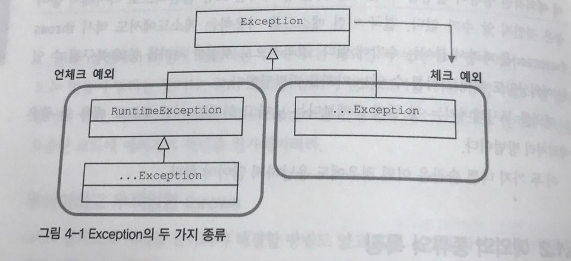

## 4.1 사라진 SQLException

- 3장에서 JdbcTemplate을 적용하면서 throws SQLException이 사라졌다. 왜 사라졌을까?

### 4.1.1 초난감 예외처리
- 예외 블랙홀
	- Case 1: 아무 처리도 하지 않는다.
	
		```
		try {
			...
		} catch(SQLException e) {
		}
		```
	- Case 2: 로그만 남긴다.
	
		```
		try {
			...
		} catch(SQLException e) {
			System.out.println(e); // 또는
			e.printStackTrace(); // 콘솔로그로만 남고 발견되기 힘들다
		}
		```
	- Case 3: 프로그램을 종료시킨다.
	
		```
		try {
			...
		} catch(SQLException e) {
			e.printStackTrace();
			System.exit(1); // 그나마 나은 처리
		}
		```

- 무책임한 처리
	- 다음과 같이 책임을 전가하는 식의 예외처리는 상위에서 예외에 대한 유의미한 정보나 대처를 하기 힘들게 만든다.
	
		```
		public void method1() throws Exception {
			method2();
		}
		public void method2() throws Exception {
			method3();
		}
		public void method3() throws Exception {
			...
		}
		```

### 4.1.2 예외의 종류와 특징
- java.lang.Exception과 그 하위 클래스들은 개발자들이 만든 애플리케이션 코드 작업 중 예외상황에 사용된다.
- 이 Exception은 다시 체크 예외와 언체크 예외로 나뉜다.
	
	- 체크 예외: 
		- RuntimeException을 상속하지 않는다.
		- 반드시 catch하거나 throw로 잡아주고 넘어가야한다.
		- 일반적으로 예외라고 하면 체크예외를 뜻한다.
	- 언체크 예외:
		- RuntimeException을 상속한다.
		- 예외처리를 강요하지 않는다.
		- NullPointerException이나 IllegalArgumentExcpetion과 같이 프로그램에 오류가 있을 때 발생하도록 의도한 것으로 개발자가 주의만 한다면 피할 수 있는 상황들이다.

- RuntimeException의 보편화로 예외처리를 무시하거나 남용하는 상황이 증가했다.

### 4.1.3 예외처리 방법
- 예외 복구: 예외로 인해 기본 작업 흐름이 불가능한 경우 다른 잘업 흐름으로 유도해주는 것이며 단순히 에러메시지를 보이는 것은 예외복구라고 하지 않는다.
	- 예제) 서버와의 연결 재시도 횟수를 정하여 복구의 기회를 준다.
- 예외처리 회피: 자신이 처리하지 않고 회피하는 방식. 하지만 throws Exception을 분명한 의도 없이 사용할 경우 아무 의미가 없다.
	- 예제) 3장에서 만들었던 JdbcTemplate이 사용하는 콜백 오브젝트들이 SQLException을 회피하고 있다. 이 콜백 오브젝트들이 해야할 역할이 아니기 때문에 템플릿이 처리하도록 하는 것이다.
- 예외 전환: 발생한 예외를 적절한 예외로 전환하여 던진다.
	- 예제) 중복 아이디 문제로 데이터베이스에 insert가 안될 때 구체적으로 중복 아이디 문제인지를 알리기 위하여 SQLException 대신 DuplicateUserIdException 예외를 던진다.
	- 예제) 예외처리를 단순화시키기 위해 사용되며 주로 체크 예외를 언체크 예외로 바꿔줘야하는 상황에서 이용된다.

### 4.1.4 예외처리 전략
- 런타임 예외의 보편화
	- 독립형 애플리케이션에서는 시스템 통제 불가능한 예외라도 애플리케이션 작업이 중단되지 않게 해주어야한다.
	- 하지만 서버환경에서는 여러 사용자가 이용하는 경우 해당 작업만 중단 시키면 된다.
	- 위와 같은 환경이 조성되면서 차라리 미리 파악하고 차단하는게 낫다는 생각이 보편화 되다보니 런타임 예외처리가 보편화 되고 있다.
- 예제) add() 메소드의 예외처리
	- SQLException에 이어 추가된 DuplicateUserIdException 런타임 예외처리로 바꿔서 상위 레벨에서 처리해주는 것이 바람직하다.
	
		```
		public class DuplicateUserIdException extends RuntimeException {
			public DuplicateUserIdException(Throwable cause) {
				super(cause);
			}
		}

		public void add() throws DuplicateUserIdException {
			try{
				...
			} catch(SQLException e) {
				if(e.getErrorCode() == MysqlErrorNumbers.ER_DUP_ENTRY)
					throw new DuplicateUserIdException(e);
			}
		}
		```
- 애플리케이션 예외: 외부에 의한 것이 아닌 애플리케이션 자체의 로직에 의한 예외로서 catch해서 무엇인가 조치를 취하도록 하게 한다.
	- 예제) 계좌 출금 애플리케이션에서 잔고에 있는 금액보다 많이 출금하려 할 때 다음과 같은 두 가지 방법을 생각해볼 수 있다.
		1. 부족했을 때 리턴되는 값을 각각 다르게 한다. // 통일 되지 않은 리턴 값으로 혼선을 빚을 수 있다.
		2. InsufficientBalacneException이라는 예외처리를 만들어 catch한다. 
		
		```
		try {
			BigDecimal balance = account.withdraw(amount);
			// 인출하고 정상 처리 결과 출력
		} catch(InsufficientBalacneException) {
			// 인출 가능 금액 호출하여 출력
		}
		```

### 4.1.5 SQLException은 어떻게 됐나?
- SQLException에서 생긴 예외들은 잡더라도 복구시켜줄 방법이 없어 빠졌다.
- 대신 JdbcTemplate과 콜백안에서 발생하는 SQLException을 런타임 예외인 DataAccessException으로 포장하여 던져주게 만들었다.
