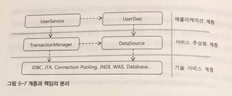

# 5.3 서비스 추상화와 단일 책임의 원칙
- 수직 수평 계층구조와 의존 관계

- 단일 책임 원칙 (Single Responsibility Principle)
	- UserService가 JDBC Connection 코드를 직접 이용할 때는 사용자 레벨 관리 및 트렌젝션 관여 등 한가지 이상의 책임이 있었다.
	- 단일 책임 원칙의 장점: 수정 대상이 분명하며 수정 시 복잡도와 수정 필요한 부분이 줄어든다.
	- DI를 적극 이용하라.