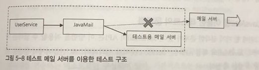
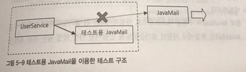
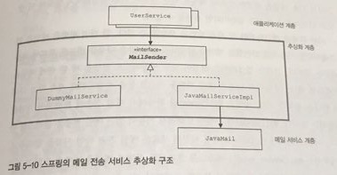
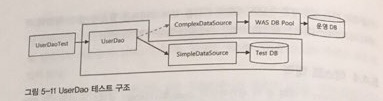
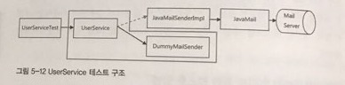

# 5.4 메일 서비스 추상화
## 5.4.1 JavaMail을 이용한 메일 발송 기능
- User 테이블에 email 필드, User 클래스에 email 프로퍼티를 추가, UserDao의 userMapper, insert, update에 대해 email 관련 처리 코드를 넣고 이메일 발송 기능을 구현해본다.

### JavaMail 메일 발송
- upgradeLevel 메소드에 sendUpgradeEMail 메소드를 호출하도록 만들고 sendUpgradeEMail에 대한 구현을 다음과 같이 해준다.

```
protected void sendUpgradeEMail(User user) {
	Properties props = new Properties();
	props.put("mail.smtp.host", "mail.ksug.org");
	Session s = Session.getInstance(props, null);

	MimeMessage message = new MimeMessage(s);
	try {
		message.setFrom(new InternetAddress("useradmin@ksug.org"));
		message.addRecipient(Message.RecipientType.TO,
								new INternetAddress(user.getEmail()));
		message.setSubject("Upgrade 안내");
		message.setText("사용자님의 등급이 " + user.getLevel().name() + "로 업그레이드 되셨습니다.");

		Transport.send(message);
	} catch (AddressException e) {
		throw new RuntimeException(e);
	} catch (MessagingException e) {
		throw new RuntimeException(e);
	} catch (UnsupportedEncodingException e) {
		throw new RuntimeException(e);
	}
}
```

## 5.4.2 JavaMail이 포함된 코드 테스트 
- 위와 같은 방법으로 할 경우 테스트를 하고자 할 때 sendUpgradeEMail 메소드가 불릴 때마다 매번 메일이 보내질 것이다.
	- 이메일을 보내는 것은 부가적인 기능이며 보낸 메일이 도착했는지 테스트 하지는 않기에 이 메소드 테스트를 위해서 서버에 부하를 줄 필요가 없다.
		- 테스트용 메일 서버를 만들어서 테스트 해 볼 수 있다.

		

	- JavaMail은 검정된 표준 기술이므로 JavaMail API를 이용해서 요청을 보낸 후의 테스트 불필요하다고 볼 수 있다. 그래서 다음과 같이 테스트를 간소화 할 수 있다.

		

## 5.4.3 테스트를 위한 서비스 추상화 
- 인터페이스를 갖는 오브젝트를 만들어서 사용하면 테스트 구현이 완성될 것 같지만 JavaMail 구현을 바꿀 수가 없다.
	- 가장 먼저 생성되는 javax.mail.Session은 생성이 되어야 메시지를 생성할 수 있으며 이는 인터페이스며, 생성자가 모두 private이고 상속이 안되는 final 클래스다.

### 메일 발송 기능 추상화
- 스프링에서 제공하는 JavaMail를 추상화하는 MailSender 인터페이스를 이용하여 문제를 해결해보자.
```
package org.springframework.mail;
...
public interface MailSender {
	void send(SimpleMailMessage simpleMessage) throws MailException;
	void send(SimpleMailMessage[] simpleMessage) throws MailException;
}
```
- 다음과 같이 위 인터페이스와 MailMessage 인터페이스를 각각 구현한 클래스의 오브젝트를 만들어본다.
```
private void sendUpgradeEMail(User user) {
	JavaMailSenderImpl mailSender = new JavaMailSenderImpl();
	mailSender.setHost("mail.server.com");

	SimpleMailMessage mailMessage = new SimpleMailMessage();
	mailMessage.setTo(user.getEmail);
	mailMessage.setFrom("useradmin@ksug.org");
	mailMessage.setSubject("Upgrade 안내");
	mailMessage.setText("사용자님의 등급이 " + user.getLevel().name() + "로 업그레이드 되셨습니다.");

	mailSender.send(mailMessage);
}
```
- try/catch는 JavaMail에서 생성된 에러는 스프링에서 런타임으로 해주기에 빠진다.
- UserService에서 DI를 받을 수 있도록 바꿔주고 sendUpgradeEmail도 그에 맞게 바꿔준다.
```
public class UserService {
	...
	private MailSender mailSender;

	public void setMailSender(MailSender mailSender) {
		this.mailSender = mailSender;
	}

	private void sendUpgradeEMail(User user) {
		SimpleMailMessage mailMessage = new SimpleMailMessage();
		mailMessage.setTo(user.getEmail);
		mailMessage.setFrom("useradmin@ksug.org");
		mailMessage.setSubject("Upgrade 안내");
		mailMessage.setText("사용자님의 등급이 " + user.getLevel().name() + "로 업그레이드 되셨습니다.");

		mailSender.send(mailMessage);
	}
}
```
### 테스트용 메일 발송 프로젝트
- MailSender라는 구현체를 만들어 DI에서 사용될 수 있도록 해보자.
- 아무것도 하지 않는 DummyMailSender라는 MailSender 구현체를 만든다. 그리고 JavaMailSenderImpl 대신 빈으로 등록해준다.
```
package springbook.user.service;
...
public class DummyMailSender implements MailSender{
	public void send(SimpleMessage mailMessage) throws MailException {
	}

	public void send(SimpleMessage[] mailMessage) throws MailException {
	}
}
```
- UserServiceTest를 만들어 준다.
```
public class UserServiceTest {
	...
	@Autowired
	MailSender mailSender;

	@Test
	public void upgradeAllOrNothing() throws Exception {
		...
		testUserService.setMailSender(mailSender);
	}
}
```
### 테스트와 서비스 추상화



- 다양한 트랜잭션 기술에 대한 추상화 클래스를 제공하는 방식과는 달리 MailSender를 구현하는 클래스는 JavaMailServiceImpl 하나이다.
	- 추후 JavaMail 외 다른 API를 이용할 경우 JavaMailServiceImpl와 같은 구현만 해주면 된다.
- 현 예제에서도 트랜잭션 개념 적용이 필요하며 두 가지 방법을 생각해 볼 수 있다.
	1. 업그레이드 작업이 모두 완료된 후 한번에 보낸다.
		- 이메일 리스트 전체를 파라미터를 갖고 있어야한다는 단점이 있다.
		- 비즈니스 로직과 트랜잭션 개념을 적용하는 부분이 혼합 되어 있다.
	2. MailSender를 확장해서 메일 전송에 트랜잭션을 적용한다. 
		- MailSender를 구현한 트랜잭션 기능이 있는 클래스를 만들고 이 오브젝트의 업그레이 작업 전에 새로운 메일 전송 시작을 알려준다. mailSender.send()를 호출 저장만 해두고 업그레이드가 완료되면 모두 발송한다.
		- 비즈니스 로직과 트랜잭션 개념을 적용하는 부분이 혼합 되어있지 다.

## 5.4.4 테스트 대역
### 의존 오브젝트의 변경을 통한 테스트 방법
- 테스트를 할 때 실 DB에 연결할 경우 DB풀링이나 DB의 리소스를 사용할 필요가 없다.
- UserDaoTest에서는 Dao를 테스트 하기 위해 테스트 디비를 이용할 필요가 있다.



- UserServiceTest에서는 User 서비스 정보 가공이 잘 작동하는지만 확인하면 되기 때문에 테스트 디비를 이용할 필요가 없다. 하지만 메소드를 뺄 수는 없기에 아무 작동을 하지 않는 Dummy로 대체한 것이다.



- DI를 이용하여 간단한 환경을 만들거나 아무 일도 하지 않는 빈 오브젝트로 대체 해주면 테스트가 용이해진다.

### 테스트 대역의 종류와 특징
- 위와 같이 테스트용으로 사용되는 오브젝트들을 테스트 대역(test double)이라고 한다.
	- 테스트 스텁(test stub): 테스트 대상 오브젝트의 의존객체로 존재하면서 테스트가 정상 작동하도록 도와준다. (ex. DummyMailSender)
- 경우에 따라 테스트 스텁이 어떤 값을 반환해야할 수도 있으며 그 반환되는 값을 검증해야할 수도 있다. 하지만 assertThat()으로 검증이 불가능하다.
	- 테스트 대상과 테스트 스텁 사이에 중간자 역할을 해주는 Mock Object를 만들어 해결해 볼 수 있다.
	
	

### 목 오브젝트를 이용한 테스트
- checkLevelUpgraded()에서 메일 발송이 일어나면 MockMailSender에 결과가 저장되게 만들고 그에 대한 접근자들을 이용하여 Test 클래스에서 이용할 수 있게 하면 된다.
```
static class MockMailSender implements MailSender {
	private List<String> requests = new ArrayList<String>();

	public List<String> getRequests() {
		return requests;
	}

	public void send(SimpleMailMessage mailMessage) throws MailException {
		requests.add(mailMessage.getTo()[0])
	}

	public void send(SimpleMailMessage[] mailMessage) throws MailException {
	}
}
```
```
public void upgradeLevels() throws Exception {
	userDao.deleteAll();
	for(User user:users) userDao.add(user);

	MockMailSender mockMailSender = new MockMailSender();
	userService.setMailSender(mockMailSender);

	userService.upgradeLevels();

	checkLevelUpgraded(users.get(0), false);
	checkLevelUpgraded(users.get(1), true);
	checkLevelUpgraded(users.get(2), false);
	checkLevelUpgraded(users.get(3), true);
	checkLevelUpgraded(users.get(4), false);

	List<String> request = mockMailSender.getRequests();
	assertThat(request.size(), is(2));
	assertThat(request.get(0), is(users.get(1).getEmail()));
	assertThat(request.get(0), is(users.get(3).getEmail()));
}
```
