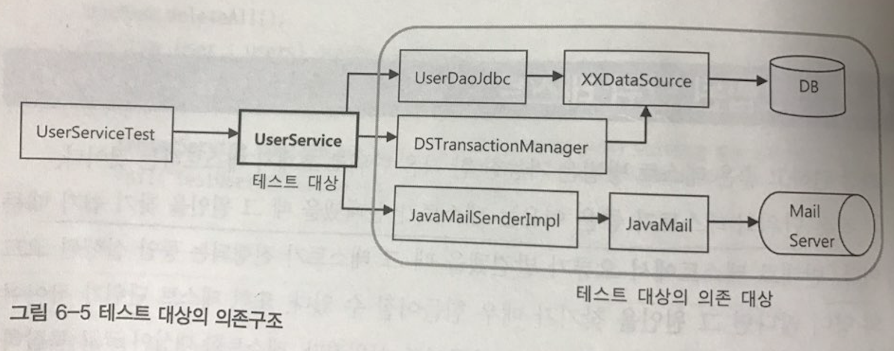
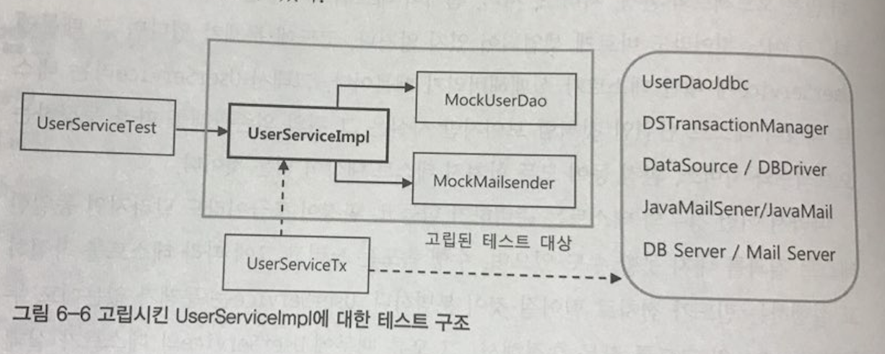

# 6.2 고립된 단위 테스트
- 단위 테스트의 필요성
- UserService의 복잡한 의존 관계 테스트 쪼개기
- 단위 테스트와 통합 테스트
- Mock freamwork

### 단위 테스트의 필요성

```
 작은 단위의 테스트가 좋은 이유는 테스트가 실패했을 때 그 원인을 찾기 쉽기 때문이다.
```

*클래스 하나가 동작하도록 테스트를 만드는 것과 클래스 수십 개가 얽히고 설혀서 동작하도록 만드는 것 중에서 어떤 것이 논리적인 오류를 찾기 쉬울지는 분명하다.*

### UserService의 복잡한 의존 관계 테스트 쪼개기

  

*UserService는 간단한 기능을 가지고 있지만, 그 기능을 테스트하려면 UserDao, MailSender, TransactionManager까지 함께 동작해야한다.*

*사실상 테스트 대상이 UserService만 되는 것이 아니라 의존관계를 따라 등장하는 오브젝트와 서비스, 환경 등이 모두 합쳐져 테스트 대상이 되는 것이다.*

```
테스트의 대상이 환경이나, 외부 서버, 다른 클래스의 코드에 종속되고 영향을 받지 않도록 고립시킬 필요가 있다.
```

// MailSender는 이미 MockMailSender라는 Mock Object를 만들어서 사용해봤다. UserDao와 TransactionManager를 분리해보자.

```java
@Test
public void upgradeLevels() throws Exception {
    //DB 테스트 데이터 준비
    userDao.deleteAll();
    for(User user:users) userDao.add(user);

    //메일 발송 여부를 확인하기 위한 목 오브젝트 DI
    MockMailSender mockMailSender = new MockMailSender();
    userServiceImpl.setMailSender(mockMailSender);

    userService.upgradeLevels();


    //DB에 저장된 결과 확인
    checkLevel(users.get(0), false);
    checkLevel(users.get(1), true);
    checkLevel(users.get(2), false);
    checkLevel(users.get(3), true);
    checkLevel(users.get(4), false);

    // 목 오브젝트를 이용한 결과 확인
    List<String> request = mockMailSender.getRequests();
    assertThat(request.size(), is(2));
    assertThat(request.get(0), is(users.get(1).getEmail()));
    assertThat(request.get(1), is(users.get(3).getEmail()));

}
```

*위 테스트는 다섯단계로 진행된다.*

  1. 테스트 실행 중에 UserDao를 통해 가져올 테스트용 정보를 DB에 넣는다.
  2. 메일 발송 여부를 확인하기 위해 mailSender mock 오브젝트를 DI해준다.
  3. 실제 테스트 대상인 userService 메소드를 실행한다.
  4. 결과가 DB에 반영되었는지 확인하기 위해서 UserDao를 이용해서 DB에서 데이터를 가져와서 비교한다.
  5. Mock 오브젝트를 통해서 userService에서 메일 발송이 일어났는지 확인한다.

```
첫번째와 네번째 단계는 실제 의존 오브젝트를 사용하므로 필요 이상의 테스트와 검증이 필요하다.
```

#### UserDao Mock Object

  *목 오브젝트는 테스트 대상을 통해 사용될 때 필요한 기능을 지원해야한다.*

upgradeLevels에서 UserDao의 역할

```java
public void upgradeLevels(){
    List<User> users = userDao.getAll(); // 업그레이드 후보 사용자 목록 가져오기.

    for (User user : users) {
        if (userLevelUpgradePolicy.canUpgradeLevel(user)) {
            upgradeLevel(user);
        }

    }
}

protected void upgradeLevel(User user) {
    user.upgradeLevel();
    userDao.update(user); // 수정된 사용자 정보를 반영하기.
}
```


upGradeLevels 테스트 검증 결과를 테스트할 방법이 필요함

-> UserDao는 테스트 대상의 코드가 정상적으로 수행되도록 도와주기만 하는 스텁이 아니라, 부가적인 검증까지 가능한 목오브젝트로 만들어져야한다.
// 스텁 오브젝트 : 비지니스 로직없이 테스트 코드만 실행하고 리턴 값은 항상 정해져있는 테스트 오브젝트

// 목 오브젝트 : 비지니스 로직을 포함하여 테스트 코드들마다 다른 리턴 값을 가지는 테스트 오브젝트

UserDao Mock Object

```java
static class MockUserDao implements UserDao {
  // 생성자를 통해 전달받은 사용자 목록을 저장해놓았다가 getAll() 메서드가 호출되면 DB에서 가져온 것처럼 돌려주는 용도
  private List<User> users;

  // update 메소드를 통해서 전달받은 update 대상 오브젝트를 저장해놓는 용도.
  private List<User> updated = new ArrayList();

  private MockUserDao(List<User> users) {
    this.users = users;
  }

  private List<User> getUpdated() {
    return this.updated;
  }

  public List<User> getAll() {
    return this.users;
  }

  public void update(User user) {
    updated.add(user);
  }

  //테스트에 사용되지 않는 메소드들
  public void add(User user) { throw new UnsupportedOperationException(); }
  public void deleteAll() { throw new UnsupportedOperationException(); }
  public void get(String id) { throw new UnsupportedOperationException(); }
  public void getCount() { throw new UnsupportedOperationException(); }

}

```

```java
@Test
public void upgradeLevels() throws Exception {
    //고립된 테스트에서는 테스트 대상 오브젝트를 직접 생성하면된다.
    UserServiceImpl userServiceImpl = new UserServiceImpl();

    //목 오브젝트로 만든 UserDao를 직접 DI해준다.
    MockUserDao mockUserDao = new MockUserDao(this.users);
    userServiceImpl.setUserDao(mockUserDao);

    //메일 발송 여부를 확인하기 위한 목 오브젝트 DI
    MockMailSender mockMailSender = new MockMailSender();
    userServiceImpl.setMailSender(mockMailSender);

    userService.upgradeLevels();

    // MockUserDao로부터 업데이트 결과를 가져온다.
    List<User> updated = mockUserDao.getUpdated();

    // 업데이트 횟수와 정보를 확인한다.
    assertThat(updated.size(), is(2));
    checkUserAndLevel(updated.get(0), "joytouch", Level.SILVER);
    checkUserAndLevel(updated.get(1), "madnite1", Level.GOLD);

    // 목 오브젝트를 이용한 결과 확인
    List<String> request = mockMailSender.getRequests();
    assertThat(request.size(), is(2));
    assertThat(request.get(0), is(users.get(1).getEmail()));
    assertThat(request.get(1), is(users.get(3).getEmail()));

}

private void checkUserAndLevel(User updated, String expectedId, Level expectedLevel) {
  assertThat(updated.getId(), is(expectedId));
  assertThat(updated.getLevel(), is(expectedLevel));
}
```

- UserService 오브젝트는 이제 완전히 고립돼서 테스트만을 위해 독립적으로 동작하는 테스트 대상을 사용할 것이기 때문에 스프링 컨테이너에서 빈을 가져올 필요가 없다.
- 사용자 정보를 등록하고 삭제하는 번거로운 준비 작업을 할 필요가 없다.
- 테스트 성능 수행의 향상이 있다. 기존에 DB 커넥션을 준비하는 과정과 비교하면 약 500배의 수행시간 차이가 발생한다.

  
고립된 테스트가 가능하도록 디자인된 그림

### 단위 테스트와 통합 테스트

####단위 테스트
- 테스트 대상 클래스를 목 오브젝트 등의 테스트 대역을 이용해 의존 오브젝트나 외부 리소스를 사용하지 않도록 고립시켜서 테스트하는 것

####통합 테스트
- 두 개 이상의, 성격이나 계층이 다른 오브젝트가 연동하도록 만들어 테스트하거나 또는 외부의 DB나 파일, 서비스 등의 리소스가 참여하는 테스트

### 목 프레임워크

```
단위 테스트를 만들기 위해서는 스텁이나 목 오브젝트의 사용이 필수적이다.
```

*하지만 목 오브젝트를 만드는 일은 큰 짐이다.*

#### Mockito 프레임워크
- 간단한 메소드 호출만으로 다이나믹하게 특정 인터페이스를 구현한 테스트용 목 오브젝트를 만들 수 있다.

UserDao 인터페이스를 구현한 테스트용 목 오브젝트는 다음과 같이 Mockito의 스태틱 메소드를 한 번 호출해주면 만들어진다.

```java
UserDao mockUserdao = mock(UserDao.class);
```

이렇게 만들어진 목 오브젝트는 아직 아무런 기능이 없다. 여기에 먼저 getAll 메소드가 불려올 때 사용자 목록을 리턴하도록 스텁기능을 추가해줘야한다.

```java
when(mockUserDao.getAll()).thenReturn(this.users);
```

- mockUserDao.getAll()이 호출됐을 때(when), users 리스트를 리턴해주라(thenReturn)는 선언이다.

```java
verify(mockUserDao, times(2)).update(any(User.class));
```

- User 타입의 오브젝트를 파라미터로 받으며 update() 메소드가 두 번 호출됐는지(times(2)) 확인하라(verify)는 선언이다.

#### Mockito의 목 오브젝트는 다음의 네 단계를 거쳐서 사용하면 된다.
  1. 인터페이스를 이용해 목 오브젝트를 만든다.
  2. 목 오브젝트가 리턴할 값이 있으면 이를 지정해준다. 메소드가 호출되면 예외를 강제로 던지게 만들 수도 있다.
  3. 테스트 대상 오브젝트에 DI 해서 목 오브젝트가 테스트 중에 사용되도록 만든다.
  4. 테스트 대상 오브젝트를 사용한 후에 목 오브젝트의 특정 메소드가 호출됐는지, 어떤 값을 가지고 몇 번 호출됐는지를 검증한다.


```
 특별한 기능을 가진 목 오브젝트를 만들어야하는 경우가 아니면 거의 대부분 단위 테스트에서 필요한 목 오브젝트는 Mockito를 사용하는 것으로 충분하다.
```

```java

@Test
public void mockUpgradeLevels() throws Exception {
  UserServiceImpl userServiceImpl = new UserServiceImpl();

  //다이나믹한 목 오브젝트 생성과 메소드의 리턴 값 설정, 그리고 DI까지 세줄이면 충분하다.
  UserDao mockUserDao = mock(UserDao.class);	    
  when(mockUserDao.getAll()).thenReturn(this.users);
  userServiceImpl.setUserDao(mockUserDao);

  MailSender mockMailSender = mock(MailSender.class);  
  userServiceImpl.setMailSender(mockMailSender);

  userServiceImpl.upgradeLevels();

  verify(mockUserDao, times(2)).update(any(User.class));				  
  verify(mockUserDao, times(2)).update(any(User.class));
  verify(mockUserDao).update(users.get(1));
  assertThat(users.get(1).getLevel(), is(Level.SILVER));
  verify(mockUserDao).update(users.get(3));
  assertThat(users.get(3).getLevel(), is(Level.GOLD));

  // 실제 MailSender 목 오브젝트에 전달된 파라미터를 가져와 내용을 검증하는 방법을 사용.
  ArgumentCaptor<SimpleMailMessage> mailMessageArg = ArgumentCaptor.forClass(SimpleMailMessage.class);  
  verify(mockMailSender, times(2)).send(mailMessageArg.capture());
  List<SimpleMailMessage> mailMessages = mailMessageArg.getAllValues();
  assertThat(mailMessages.get(0).getTo()[0], is(users.get(1).getEmail()));
  assertThat(mailMessages.get(1).getTo()[0], is(users.get(3).getEmail()));
}
```
