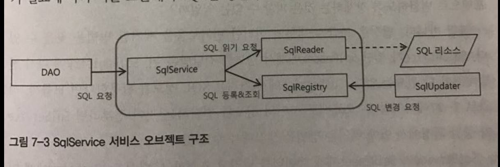
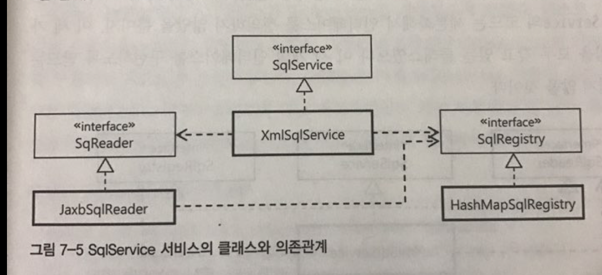

# 인터페이스의 분리와 자기 참조 빈
- 빈 설정 XML 파일이 아닌 sql 정의용 XML 파일 정의
- SqlService를 인터페이스로 쪼개기 - 자기 참조 빈


## XML 파일 매핑
-XML 설정 파일에서 bean 태그 안에 SQL 정보를 넣고 활용하는 것은 좋은 방법이 아니다.

-검색용 키와 SQL 문장 두 가지를 담을 수 있는 간단한 XMl 문서를 설계해보고, 이 XMl 파일을 이용한 SQL 서비스 구현 클래스를 만들어보자.

### JAXB
-Java Architecture for XML Binding

-java.xml.bind 패키지 안에 구현된 클래스로 XML 문서정보를 거의 동일한 구조의 오브젝트로 직접 매핑해줌.

### SQL 맵을 위한 스키마 작성과 컴파일

- 우리가 사용하고자하는 SQL 맵 XML 문서

```XML
<sqlMap>
  <sql key="userDao">insert into users(...) ...</sql>
  <sql key="userGet">select * from users ...</sql>
</sqlMap>
```

- 이 XML 문서의 구조를 정의하는 스키마
```XML
<?xml version="1.0" encoding="UTF-8"?>
<schema xmlns="http://www.w3.org/2001/XMLSchema" targetNamespace="http://www.epril.com/sqlmap"
	xmlns:tns="http://www.epril.com/sqlmap" elementFormDefault="qualified">
	<element name="sqlmap">
		<complexType>
			<sequence>
				<element name="sql" maxOccurs="unbounded" type="tns:sqlType" />
			</sequence>
		</complexType>
	</element>

    <complexType name="sqlType"> // sql에 대한 정의를 시작한다.
		<simpleContent>
			<extension base="string"> // SQL 문장을 넣을 스트링 타입을 정의한다.
				<attribute name="key" use="required" type="string" />
			</extension>
		</simpleContent>
    </complexType>
</schema>
```

- 이렇게 만든 스키마 파일을 sqlmap.xsd라는 이름으로 저장하고 JAXB 컴파일러로 컴파일 해보자.
- 다음 명령어를 이용해서 컴파일할 수 있다.

```
                                                //생성된 파일이 저장될 위치
xjc -p spring.user.sqlservice.jaxb sqlmap.xsd -d src
        //생성할 클래스의 패키지 지정
```

위 명령어를 사용하면 두 개의 바인딩용 자바 클래스와 팩토리 클래스가 만들어진다.

### XML SQL 서비스
- 이제 sqlMap.xml에 있는 SQL을 가져와 DAO에 제공해주는 SqlService 인터페이스의 구현 클래스를 만들어보자.

*언제 JAXB를 사용해 XML 문서를 가져올 것인가?*

```
DAO가 SQL을 요청할 때마다 매번 XML 파일을 읽는건 비효율적이다.

XML 파일은 한번만 읽어서 로컬 변수에 저장해야한다. 그렇다면
```

*언제 JAXB를 사용해 XML 문서를 가져올 것인가?*

-XmlSqlService 오브젝트는 빈이므로 제어권이 스프링에 있다.

-스프링은 여러가지 빈 후처리기가 있다.

-@PostConstruct 어노테이션이 붙은 메소드가 있으면 스프링은 빈 오브젝트를 생성하고 DI 작업을 마친 뒤에 실행해준다.

```java
public class XmlSqlService implements SqlService {
	private Map<String, String> sqlMap = new HashMap<String, String>();

// xml file path를 설정해줘야한다!
	private String sqlmapFile;

	public void setSqlmapFile(String sqlmapFile) {
		this.sqlmapFile = sqlmapFile;
	}

	@PostConstruct
	public void loadSql() {
		String contextPath = Sqlmap.class.getPackage().getName();
		try {
			JAXBContext context = JAXBContext.newInstance(contextPath);
			Unmarshaller unmarshaller = context.createUnmarshaller();
			InputStream is = UserDao.class.getResourceAsStream(this.sqlmapFile);
			Sqlmap sqlmap = (Sqlmap)unmarshaller.unmarshal(is);

			for(SqlType sql : sqlmap.getSql()) {
				sqlMap.put(sql.getKey(), sql.getValue());
			}
		} catch (JAXBException e) {
			throw new RuntimeException(e);
		}
	}

	public String getSql(String key) throws SqlRetrievalFailureException {
		String sql = sqlMap.get(key);
		if (sql == null)  
			throw new SqlRetrievalFailureException(key + "를 이용해서 SQL을 찾을 수 없습니다");
		else
			return sql;
	}
}
```

```xml
<bean id="sqlService" class="springbook.user.sqlservice.XmlSqlService">
  <property name="sqlmapFile" value="sqlmap.xml" />
</bean>
```

## 변화를 위한 준비: 인터페이스 분리
-SqlService에 확장성을 모두 열려있을까?

-SQL가져오는 방법이 XML 아니라 다른 방법이면 ?

-SQL 가져오는 방법과 저장하고 사용하는 방법을 분리하자!


### 책임에 따른 분리
- SqlReader : SQL 정보를 외부의 리소스로부터 읽어오는 것. 리소스는 단순 텍스트일 수도 있고, 미리 정의된 XML파일일 수도 있다.
- SqlRegistry : SQL을 보관해두고 있다가 필요할 때 제공. SQL 양에 따라 키, 값 방식 혹은 리스트 방식등으로 확장성을 고려할 수 있다.



*SqlReader가 읽어오는 SQL 정보는 다시 SqlRegistry에 어떤 방식으로 전달할 수 있을까?*

```java
//리턴 값 강제.
Map<String, String> sqls = sqlReader.readSql();

//저장 방식 강제.
sqlRegistry.addSqls(sqls);
```

#### 발상의 전환이 필요하다!
-SqlService가 SqlReader에게 전달받은 뒤 다시 SqlRegistry에 다시 전달해줘야 할 필요는 없다!

-중간에 SqlService가 SqlReader가 읽어오는 방식을 모르게, Registry가 저장하는 방식을 모르게 설계하면된다.

```java
//sqlService 코드
sqlReader.readSql(sqlRegistry);
```

```java
//SqlRegistry 메소드
public interface SqlRegistry {
  void registerSql(String key, String sql);

  String findSql(String key) throws SqlNotFountException;
}
```

```
SqlReader가 SqlRegistry와 의존관계를 가지고 작업을 진행하도록 만들었고,

SqlReader가 사용할 SqlRegistry 오브젝트를 제공해주는건 SqlService의 코드가 담당한다.
```

```java
public interface SqlReader {
  void read(SqlRegistry sqlRegistry);
}
```


```
SqlService의 구현 클래스는 이제 SqlReader와 SqlRegistry 두 개의 프로퍼티를 DI 받을 수 있는 구조로 만들어져야한다.
```




*기존에 만들었던 XmlSqlService 클래스는 이 세 가지 관심과 책임을 구분 없이 하나의 클래스에 뭉뚱그려서 만들어놓았었다*

-XmlSqlService는 3개 관심사 인터페이스를 모두 알고있다. 그렇다면 세 가지 인터페이스를 하나의 클래스에서 모두 구현해버리면 어떨까 ?

## 다중 인터페이스 구현과 간접 참조
- 자바에서 인터페이스는 한 개 이상을 상속하는 것이 가능하다.

*XmlSqlService 클래스 하나가 SqlService, SqlReader, SqlRegistry라는 세 개의 인터페이스를 구현하게 만들어보자.*

```java
public class XmlSqlService implements SqlService, SqlRegistry, SqlReader {
	// --------- SqlProvider ------------
	private SqlReader sqlReader;
	private SqlRegistry sqlRegistry;

	public void setSqlReader(SqlReader sqlReader) {
		this.sqlReader = sqlReader;
	}

	public void setSqlRegistry(SqlRegistry sqlRegistry) {
		this.sqlRegistry = sqlRegistry;
	}

	@PostConstruct
	public void loadSql() {
		this.sqlReader.read(this.sqlRegistry);
	}

	public String getSql(String key) throws SqlRetrievalFailureException {
		try {
			return this.sqlRegistry.findSql(key);
		}
		catch(SqlNotFoundException e) {
			throw new SqlRetrievalFailureException(e);
		}
	}

	// --------- SqlRegistry ------------
	private Map<String, String> sqlMap = new HashMap<String, String>();

	public String findSql(String key) throws SqlNotFoundException {
		String sql = sqlMap.get(key);
		if (sql == null)  
			throw new SqlRetrievalFailureException(key + "를 이용해서 SQL을 찾을 수 없습니다");
		else
			return sql;

	}

	public void registerSql(String key, String sql) {
		sqlMap.put(key, sql);
	}

	// --------- SqlReader ------------
	private String sqlmapFile;

	public void setSqlmapFile(String sqlmapFile) {
		this.sqlmapFile = sqlmapFile;
	}

	public void read(SqlRegistry sqlRegistry) {
		String contextPath = Sqlmap.class.getPackage().getName();
		try {
			JAXBContext context = JAXBContext.newInstance(contextPath);
			Unmarshaller unmarshaller = context.createUnmarshaller();
			InputStream is = UserDao.class.getResourceAsStream(sqlmapFile);
			Sqlmap sqlmap = (Sqlmap)unmarshaller.unmarshal(is);
			for(SqlType sql : sqlmap.getSql()) {
				sqlRegistry.registerSql(sql.getKey(), sql.getValue());
			}
		} catch (JAXBException e) {
			throw new RuntimeException(e);
		} 		
	}
}

```

------------------------------------------------
```
XmlSqlService안에 sqlReader, sqlRegistry를 set하는 부분은 사실 자기 자신도 넣을 수 있다.
```
------------------------------------------------

```xml
<bean id="sqlService" class="springbook.user.sqlservice.XmlSqlService">
  <property name="sqlReader" ref="sqlService" />
  <property name="sqlRegistry" ref="sqlService" />
  <property name="sqlmapFile" value="sqlmap.xml" />
</bean>
```

- 스프링은 프로퍼티의 ref 항목에 자기 자신을 넣는 것을 허용한다.

- 빈은 sqlService 하나만 선언했으므로 실제 빈 오브젝트도 한 개만 만들어진다.


### 확장 가능한 기반 클래스
- 하나의 클래스에 세 개의 인터페이스를 넣지말고, SqlRegistry와 SqlReader를 이용하는 가장 간단한 SqlService 구현 클래스를 만들어보자

```java
public class BaseSqlService implements SqlService {
	private SqlReader sqlReader;
	private SqlRegistry sqlRegistry;

	public void setSqlReader(SqlReader sqlReader) {
		this.sqlReader = sqlReader;
	}

	public void setSqlRegistry(SqlRegistry sqlRegistry) {
		this.sqlRegistry = sqlRegistry;
	}

	@PostConstruct
	public void loadSql() {
		this.sqlReader.read(this.sqlRegistry);
	}

	public String getSql(String key) throws SqlRetrievalFailureException {
		try {
			return this.sqlRegistry.findSql(key);
		}
		catch(SqlNotFoundException e) {
			throw new SqlRetrievalFailureException(e);
		}
	}
}
```

```xml
<bean id="sqlService" class="springbook.user.sqlservice.BaseSqlService">
  <property name="sqlReader" ref="sqlReader" />
  <property name="sqlRegistry" ref="sqlRegistry" />
</bean>

<bean id="sqlReader" class="springbook.user.sqlservice.JaxbXmlSqlReader">
  <property name="sqlmapFile" value="sqlmap.xml" />
</bean>

<bean id="sqlRegistry" class="springbook.user.sqlservice.HashMapSqlRegistry">
</bean>
```

- 위와 같은 경우는 기능을 확장할수있게 한다는 목적아래 3개의 빈을 등록해줘야 한다는 번거로운 점이 있다.
- 이렇게 확장을 고려해서 기능을 분리하고 DI를 적용한다면 늘어난 클래스와 인터페이스 구현의 부담은 감수해야한다.
- 하지만 특정 의존 오브젝트가 대부분의 환경에서 거의 디폴트라고 해도 좋을 만큼 기본적으로 사용될 가능성이 있다면?


## 디폴트 의존관계
- 디폴트 의존관계란 외부에서 DI 받지 않는 경우 기본적으로 자동적용되는 의존관계를 말한다.

```java

public class DefaultSqlService extends BaseSqlService {
	public DefaultSqlService() {
		setSqlReader(new JaxbXmlSqlReader());
		setSqlRegistry(new HashMapSqlRegistry());
	}

```

```xml
<bean id="sqlService" class="springbook.user.sqlservice.DefaultSqlService">
```

'디폴트 의존관계는 단지 위 코드만 있으면 된다.'

```
DefaultSqlService는 BaseSqlService를 상속하고 있다.

이를 이용해서 원한다면 언제든지 sqlReader와 sqlRegistry 프로퍼티를 주입해줄 수 있다.
```

```xml
<bean id="sqlService" class="springbook.user.sqlservice.DefaultSqlService">
  <property name="sqlRegistry" ref="ultraSuperFastSqlRegistry" />
</bean>
```


#### 디폴트 의존 오브젝트와 값을 이용해 설정을 간단하게 해주고 미리 준비된 기능을 손쉽게 사용할 수 있으면서도, 필요한 부분은 언제든지 확장 가능한 구조를 갖는 빈으로 만들었따.
