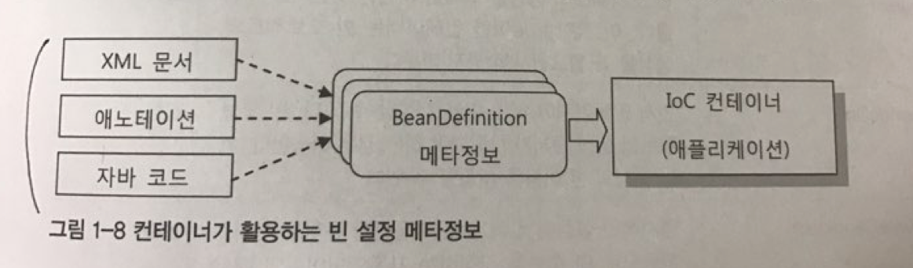

# IoC/DI를 위한 빈 설정 메타정보 작성

IoC 컨테이너의 가장 기본적인 역할은 코드 대신해서 애플리케이션을 구성하는 오브젝트를 생성하고 관리하는 것이다.

컨테이너는 어떻게 자신이 만들 오브젝트가 무엇인지 알 수 있을까?

빈을 만들기 위한 설정 메타정보는 파일이나 애노테이션 같은 리소스로부터 전용 리더를 통해 읽혀서 BeanDefinition 타입의 오브젝트로 변환된다. 이 BeanDefinition 정보를 IoC 컨테이너가 활용하는 것이다.



## 빈 설정 메타정보

BeanDefinition에는 IoC 컨테이너가 빈을 만들 때 필요한 핵심 정보가 담겨 있다.

BeanDefinition에 정의되어 있는 빈의 핵심 메타정보를 살펴보자.

- beanClassName : 빈 오브젝트의 클래스 이름. 빈 오브젝트는 이 클래스의 인스턴스가 된다.
    - default : 없음. 필수항목
- id/name : 빈의 식별자
    - default : 없음
- parentName : 빈 메타정보를 상속받을 부모 BeanDefinition의 이름. 빈의 메타정보는 계층구조로 상속할 수 있다.
    - default : 없음.
- factoryBeanName : 팩토리 역할을 하는 빈을 이용해 빈 오브젝트를 생성하는 경우에 팩토리 빈의 이름을 지정한다.
    - default : 없음.
- factoryMethodName : 다른 빈 또는 클래스의 메소드를 통해 빈 오브젝트를 생성하는 경우 그 메소드 이름을 지정한다.
    - default : 없음.
- scope : 빈 오브젝트의 생명주기를 결정하는 스코프를 지정한다. 크게 싱글톤과 비싱글톤 스코프로 구분할 수 있다.
    - default : 싱글톤.
- lazyInit : 빈 오브젝트의 생성을 최대한 지연할 것인지를 지정한다. 이 값이 true이면 컨테이너는 빈 오브젝트의 생성을 꼭 필요한 시점까지 미룬다.
    - default : false
- dependsOn : 먼저 만들어져야 하는 빈을 지정할 수 있다. 빈 오브젝트의 생성 순서가 보장돼야 하는 경우 이용한다. 하나 이상의 빈 이름을 지정할 수 있다.
    - default : 없음.
- autowireCandidate : 명시적인 설정이 없어도 미리 정해진 규칙을 가지고 자동으로 DI 후보를 결정하는 자동와이어링의 대상으로 포함시킬지의 여부
    - default : true
- primary : 자동와이어링 작업 중에 DI 대상 후보가 여러 개가 발생하는 경우가 있다. 이때 최종 선택의 우선권을 부여할지 여부. primary가 지정된 빈이 없이 여러 개의 후보가 존재하면 자동와이어링 예외가 발생한다.
    - default : false
- abstract : 메타정보 상속에만 사용할 추상 빈으로 만들지의 여부. 추상 빈이 되면 그 자체는 오브젝트가 생성되지 않고 다른 빈의 부모 빈으로만 사용된다.
    - default : false
- autowireMode : 오토와이어링 전략. 이름,타입,생성자,자동인식 등의 방법이 있다.
    - default : 없음.
- dependencyCheck : 프로퍼티 값 또는 레퍼런스가 모두 설정되어 있는지 검증하는 작업의 종류
    - default : 체크하지 않음.
-initMethod : 빈이 생성되고 DI를 마친 뒤에 실행할 초기화 메소드의 이름
    - default : 없음.
- destroyMethod : 빈의 생명주기가 다 돼서 제거하기 전에 호출할 메소드의 이름
    - default : 없음.
- propertyValues : 프로퍼티의 이름과 설정 값 또는 레퍼런스. 수정자 메소드를 통한 DI작업에서 사용한다.
    - default : 없음.
- constructorArgumentValues : 생성자의 이름과 설정 값 또는 레퍼런스. 생성자를 통한 DI작업에서 사용한다.
    - default : 없음.
- annotationMetadata : 빈 클래스에 담긴 애노테이션과 그 애트리뷰트 값. 애노테이션을 이용하는 설정에서 활용한다.
    - default : 없음.


## 빈 등록 방법

빈 등록은 빈 메타정보를 작성해서 컨테이너에게 건네주면 된다.

보통 XML 문서, 프로퍼티 파일, 소스코드 애노테이션과 같은 외부 리소스로 빈 메타정보를 작성하고 이를 적절한 리더나 변환기를 통해 애플리케이션 컨텐스트가 사용할 수 있는 정보로 변환해주는 방법을 사용한다.

### XML:<bean>태그

<bean> 태그를 사용하는 건 가장 단순하면서도 가장 강력한 설정 방법이다.

```xml
<bean id="hello" class="spring...bean.Hello">
  ...
</bean>
```


### XML: 네임스페이스와 전용 태그

등록된 빈 들은 각각 성격이 존재한다. 컨트롤러, 서비스. 레파지토리, 설정 등..

하지만 위와 같은 형태로 빈을 등록하게 되면, 모든 빈이 일관되게 태그로 정의된다.

그렇게 되면 설정파일만 보고는 해당 빈의 역할을 파악하기 힘들어진다.

스프링은 이러한 상황을 위해 10여가지의 namespace와 custom-tag들을 제공해준다.

예를 들면, AOP의 포인트컷으로 등록된 빈은 아래와 같이 표현 가능하다.

```xml
<aop:pointcut id="pointcut" expression="~~~" />
```

<aop:pointcut> 태그는 앞에서 <bean>으로 선언한 것과 동일한 빈 설정 메타정보로 변환된다.

하지만 네임스페이스와 전용태그, 전용 애트리뷰트를 이용해 선언됐기 때문에 내용이 매우 분명하게 드러나고 선언 자체도 깔끔해진다.

### 자동인식을 이용한 빈 등록

XML 문서와 같이 한 곳에 명시적으로 선언하지 않고도 스프링 빈을 등록하는 방법이 있다.

빈으로 사용될 클래스에 특별한 애노테이션을 부여해주면 이런 클래스를 자동으로 찾아서 빈으로 등록해주게 할 수 있다.

이렇게 특정 애노테이션이 붙은 클래스를 자동으로 찾아서 빈으로 등록해주는 방식을 **빈 스캐닝** 을 통한 자동인식 빈 등록 기능이라고 한다.

이런 스캐닝 작업을 담당하는 오브젝트를 **빈 스캐너** 라고 한다.

-----------------

스프링의 빈 스캐너는 지정된 클래스패스 아래에 있는 모든 패키지의 클래스를 대상으로 필터를 적용해서 빈 등록을 위한 클래스들을 선별해낸다.

빈 스캐너에 내장된 디폴트 필터는 @Compoent 애노테이션이 부여된 클래스이다.

```java
//@Compoent 클래스

@Compoent
public class AnnotatedHello {
  ...
}
```

AnnotatedHello 클래스는 @Compoent가 붙어 있으므로 빈 스캐너가 감지해서 자동으로 빈으로 등록해준다.

### 빈 스캐너 사용 방법

#### AnnotationConfigApplicationContext

AnnotationConfigApplicationContext 는 빈 스캐너를 내장하고 있는 애플리케이션 컨택스트 구현 클래스다.

```java
@Test
public void simpleBeanScanning() {
  ApplicationContext ctx = new AnnotationConfigApplicationContext(
    "springbook.learningtest.spring.ioc.bean"
  );

  AnnotatedHello hello = ctx.getBean("annotatedHello", AnnotatedHello.class);

  assertThat(hello, is(notNullValue()));
}
```

#### XML을 이용한 빈 스캐너 등록

xml 설정 파일 안에 context 스키마의 전용 태그를 넣어서 간단히 빈 스캐너를 등록할 수 있다.

```xml
<context:compoent-scan base-package="springbook.learningtest.spring.ioc.bean" />
```

#### 빈 스캐너를 내장한 애플리케이션 컨텍스트 사용

xml에 빈 스캐너를 지정하는 대신 아예 빈 스캐너를 내장한 컨텍스트를 사용하는 방법도 있다.

```xml
<context-param>
  <param-name>contextClass</param-name>
  <param-value>
    org.springframework...support.AnnotationConfigApplicationContext
  </param-value>
</context-param>
```


------------

## 자바 코드에 의한 빈 등록: @Configuration 클래스의 @Bean 메소드

자바 코드에 의한 빈 등록 기능은 하나의 클래스 안에 여러 개의 빈을 정의할 수 있다. 또 애노테이션을 이용해 빈 오브젝트의 메타정보를 추가하는 일도 가능하다.

```
 빈 설정 메타정보를 담고 있는 자바코드는 @Configuration 애노테이션이 달린 클래스를 이용해 작성한다.

 클래스에 @Bean이 붙은 메소드를 정의할 수 있는데, 이 @Bean 메소드를 통해 빈을 정의할 수 있다.

 XML 문서의 루트인 <beans>를 @Configuration 클래스로, 각 <bean>을 @Bean 메소드로 대응해서 생각해보면 이해하기 쉬울 것이다.
```

```java
// 빈 정의용 클래스
@Configuration
public class AnnotatedHelloConfig {

  // @Bean이 붙은 메소드 하나가 하나의 빈을 정의한다.
  @Bean
  public AnnotatedHello annotatedHello() {
    return new AnnotationHello(); // 자바코드를 이용해 오브젝트를 만들고 초기화 후 리턴해줄 수 있다. 컨테이너는 이 리턴 오브젝트를 빈으로 활용한다.
  }
}
```

@Configuration과 @Bean이 붙으면 스프링 컨테이너가 인식할 수 있는 빈 메타정보 겸 빈 오브젝트 팩토리가 된다.

이 팩토리를 사용하기 위해서 AnnotationConfigApplicationContext의 생성자 파라미터로 @Configuration이 부여된 클래스를 넣어주면 된다.

```java

ApplicationContext ctx = new AnnotationConfigApplicationContext(AnnotatedHelloConfig.class);

AnnotatedHello hello = ctx.getBean("annotatedHello", AnnotatedHello.class);

```

@Bean이 붙은 메소드로 만들어진 빈은 싱글톤을 보장한다.

때문에 해당 메소드가 여러 번 호출돼도 매번 동일한 빈 오브젝트가 리턴된다.

```
자바 코드를 이용한 빈 등록은 단순한 빈 스캐닝을 통한 자동인식으로는 등록하기 힘든 기술 서비스 빈의 등록이나

컨테이너 설정용 빈을 XML 없이 등록하려고 할 때 유용하게 사용될 수 있다.
```

-------------------

위 내용을 확인하기 위해서 인프라 빈인 dataSource 빈 설정 파일을 확인해보자.

```XML
<bean id="dataSource" class="org.springframework.jdbc.dataSource.SimpleDriverDataSource">
  <property name="driverClass" value="com.mysql.jdbc.Driver" />
  <property name="url" value="jdbc:mysql://localhost//testdb" />
  <property name="username" value="spring" />
  <property name="password" value="book" />
</bean>
```

이 dataSource 빈을 <bean> 대신 빈 스캐너로 자동인식해서 등록할 수 있을까?

물론 패턴 필터를 이용하면 할 수 있지만 매우 복잡하다.

아래와 같은 자바 코드를 이용한 빈 설정을 이용하면 간단하다.

```java
@Configuration
public class ServiceConfig {
  @Bean
  public DataSource dataSource() {
    SimpleDriverDataSource dataSource = new SimpleDriverDataSource();
    dataSource.setDriverClass("com.mysql.jdbc.Driver");
    dataSource.setUrl("jdbc:mysql://localhost//testdb");
    dataSource.setUsername("spring");
    dataSource.setPassword("book");
  }
}
```

이러한 자바코드에 의한 빈 설정은 다음과 같은 장점이 있다.

1. 컴파일러나 IDE를 통한 타입 검증이 가능하다
  - 디버깅이 쉽다.

2. 자동완성과 같은 IDE 지원 기능을 최대한 이용할 수 있다.
  - XML은 자동완성을 이용하기 어렵다.

3. 이해하기 쉽다.

4. 복잡한 빈 설정이나 초기화 작업을 손쉽게 할 수 있다.

--------------------

### 자바 코드에 의한 빈 등록 : 일반 빈 클래스의 @Bean 메소드

@Configuration 붙은 클래스가 아닌 일반 POJO 클래스에도 @Bean을 사용할 수 있다.

하지만 @Configuration이 붙은 클래스와는 다음과 같은 차이점이 있다.

```
일반 빈 클래스에 @Bean을 사용한 경우, DI 설정을 위해 다른 @Bean 메소드를 직접 호출하면 매번 다른 오브젝트가 리턴된다.

즉 싱글톤 빈으로 사용되지 않는다.
```

그래서 일반적으로는 @Bean메소드를 통해 정의되는 빈이 클래스로 만들어지는 빈과 매우 밀접한 관계가 있는 경우, 특별히 종속적인 빈인 경우에 사용할 수 있다.

----------------

## 빈 의존 관계 설정 방법

빈 오브젝트 사이의 DI를 위한 의존관계 메타정보를 작성하는 방법을 알아보자

1. 명시적으로 구체적인 빈을 지정하는 방법, DI할 빈의 아이디를 직접 입력

2. 일정한 규칙에 따라 자동으로 선정하는 방법, 타입 비교를 통해서 호환되는 타입의 빈을 DI하는 Autowiring 방법

### 첫번째 방법 : XML <property>, <constructor-arg>

<bean>을 이용해 빈을 등록했다면 프로퍼티와 생성자 두 가지 방식으로 DI를 지정할 수 있다.

프로퍼티는 자바빈 규약을 따르는 수정자 메소드를 사용하고 생성자는 빈 클래스의 생성자를 이용하는 방법이다.

#### <property>: 생성자 주입

수정자를 통해 의존관계의 빈을 주입하려면 <property> 태그를 사용할 수 있다.

```xml
<bean ...>
  <property name="printer" ref="defaultPrinter" />
<bean>

<bean id="defaultPrinter" ...>
```

printer 클래스는 setter 메소드를 가지고 있어서 property 태그를 통해서 printer 구현체를 DI 받고있다.

#### <constructor-arg>: 생성자 주입

<constructor-arg>는 생성자를 통한 빈 또는 값의 주입에 사용된다.

```java
public class Hello {
  ...
  public Hello(String name, Printer printer) {
    this.name = name;
    this.printer = printer;
  }
}
```

다음과 같이 생성자가 정의된 클래스에 프로퍼티들을 DI하는 방법은 다음과 같다.

```xml
//index 지정 방법
<bean id="hello" class="springbook.learningtest.spring.ioc.bean.Hello">
  <constructor-arg index="0" value="Spring" />
  <constructor-arg index="1" ref="printer" />
</bean>
```

### 두번째 방법 : XML 방식 AutoWiring

- byName : 빈 이름 AutoWiring

다음과 같이 프로퍼티 이름과 빈 아이디에 같은 이름이 반복적으로 나타나는 모습을 쉽게 찾을 수 있다.

```xml
<bean id="hello" class...>
  <property name="printer" ref="printer" />
</bean>

<bean id="printer" ...>
```

이런 경우 다음과 같이 autowire 옵션을 추가함으로써 프로퍼티 이름과 같은 인터페이스 빈을 DI해줄 수 있다.

```xml
<bean id="hello" class="...Hello" autowire="byName">
</bean>

<bean id="printer" class="...Hello">
</bean>
```

printer 프로퍼티 선언은 생략됐지만, autowire 옵션에 의해서 printer id의 이름을 가진 빈을 자동으로 넣어주고 있다.


---------------

- byType : 타입에 의한 AutoWiring

타입에 의한 오토와이어링은 프로퍼티의 타입과 각 빈의 타입을 비교해서 자동으로 연결해주는 방법이다.

autowire="byType"을 <bean>에 넣어주거나 default-autowire="byType"을 <beans>에 넣어주면된다.

```xml
//hello 클래스에서 printer type을 set 받고있음
<bean id="hello" class="..Hello" autowire="byType">... </bean>

// printer type bean
<bean id="mainPrinter" class="...StringPrinter" />
```

타입에 의한 방식은 빈의 이름이나 프로퍼티 이름에 신경을 쓰지 않아도 되기 때문에 편리하다.

대신 타입에 의한 오토와이어링 타입이 같은 빈이 두 개 이상 존재하는 경우에는 적용되지 못한다.

--------------

XML 대신 애노테이션을 이용해 빈의 이존관계를 정의할 수 있는 방법은 두 가지가 있다.

### 애노테이션 : @Resource

빈이 자동으로 주입될 곳에 @Resource 애노테이션을 붙이는 방법이다.

애노테이션은 다음과 같이 수정자 메소드나 필드에 직접 붙을 수 있다.

```java
public class Hello {
  private Printer printer;

  @Resource(name="printer")
  public void setPrinter(Printer printer) {
    this.printer = printer;
  }

}
```

```java
public class Hello {

  @Resource(name="printer")
  private Printer printer;
  // setter 메소드 없음.
}
```

name 엘리먼트를 생략하면 DI할 빈의 이름이 프로퍼티나 필드 이름과 같다고 가정한다.

```java
@Resource
private Printer printer;
```

### 애노테이션 @Autowired/@inject

애노테이션 의존 관계 설정 방법 두 번째는 @Autowired와 @Inject를 이용하는 것이다.

- Autowired: Spring 2.5부터 적용된 스프링 전용 애노테이션
- Inject: JavaEE6의 표준 스펙


#### Autowired

XML의 타입에 의한 오토와이어링을 생성자, 필드, 수정자 메소드, 일반 메소드의 네 가지로 확장한 것이다.


- 수정자 메소드와 필드
  - @Resource와 비슷하게 수정자 메소드와 필드에 애노테이션을 붙일 수 있지만 다른 점은 이름 대신 필드나 프로퍼티 타입을 이용해 후보 빈을 찾는다는 것이다. XML의 byType과 비슷하다.

```java
public class Hello {
  private Printer printer;

  @Autowired
  public void setPrinter(Printer printer) {
    this.printer = printer;
  }

}
```

```java
public class Hello {

  @Autowired
  private Printer printer;

}
```

---------------


- 생성자
  - @Autowired 는 @Resource와는 다르게 생성자에도 부여할 수 있다. 이때는 생성자의 모든 파라미터에 타입에 의한 자동와이어링이 적용된다.

```java

public class BasSqlService implements SqlService {
  protected SqlReader sqlReader;
  protected SqlRegistry sqlRegistry;

  @Autowirted
  public BasSqlService(SqlReader sqlReader, SqlRegistry sqlReader) {
    this.sqlReader = sqlReader;
    this.sqlRegistry = sqlRegistry;
  }
}
```

---------------

- 일반 메소드
  - 파라미터를 가진 메소드를 만들고 @Autowirted를 붙여주면 각 파라미터의 타입을 기준으로 자동와이어링을 해서 DI 해줄 수 있다.

```java


public class BasSqlService implements SqlService {
  protected SqlReader sqlReader;
  protected SqlRegistry sqlRegistry;

  @Autowirted
  public void config(SqlReader sqlReader, SqlRegistry sqlReader) {
    this.sqlReader = sqlReader;
    this.sqlRegistry = sqlRegistry;
  }
}
```

-------------

타입에 의한 오토와이어링은 고려할 점이 많다. 타입이 동일한 빈이 여러 개일 가능성이 있기 때문이다.

하지만 스프링에서는 중복된 타입의 빈이 존재할 때 @Autowirted를 사용할 수 있는 방법을 제공한다.

- 컬렉션과 배열
  - @Autowirted를 이용하면 같은 타입의 빈이 하나 이상 존재할 떄 그 빈들을 모두 DI받도록 할 수 있다.
  - @Autowirted의 대상이 되는 필드나 프로퍼티, 메소드의 파라미터를 컬렉션이나 배열로 선언하면 된다.

```java
@Autowirted
Collection<Printer> printers;

@Autowirted
Printer[] printer;

```

의도적으로 타입이 같은 빈을 여러개 등록하고 이를 모두 참조하거나 그중 선별적으로 필요한 빈을 찾을 떄 사용하는 것이 좋다.


### @Qualifier

Qualifier 는 타입 외의 정보를 추가해서 자동와이어링을 세밀하게 제어할 수 있는 보조적인 방법이다.

다음과 같이 @Qualifier를 선언해서 mainDB라는 한정자값을 가진 빈으로 자동와이어링 대상을 제한할 수 있다.

```java
@Autowirted
@Qualifier("mainDB")
DataSource dataSource;
```

그리고 이 한정자 정보를 다음과 같이 xml 빈 태그에 추가할 수 있고,

```xml
<bean id="oracleDataSource" class="...xxxDataSource" >
  <qualifier value="mainDB" />
</bean>
```

다음과 같이 @Compoent에 특정할 수 있다.

```java
@Compoent
@Qualifier("mainDB")
public class OracleDataSource ({};
```

만약 오토와이어링으로 빈을 찾을 수 없더라도 해당 프로퍼티의 DI를 선택적으로 가능하게 할려면 @Autowired의 required 엘리먼트를 다음과 같이 설정해주면된다.

```java
@Autowired(required=false)
Printer printer;
```

### Inject
@Inject는 @Autowirted와 매우 유사하지만 @Autowired의 required 엘리먼트에 해당하는 선택 기능이 없다.


## 자바 코드에 의한 의존관계 설정

@Configuration과 @Bean을 이용해서 자바 코드로 빈을 등록하는 경우에 빈의 의존관계를 설정하는 방법을 알아보자.

### 애노테이션에 의한 설정 @Autowired, @Resource

Hello 클래스의 printer 필드에 이미 @Autowired가 부여되어 있다고 가정한다.

```java
public class Hello {
  @Autowired Printer printer;
}
```

```java

@Configuration
public class config {
  @Bean
  public Hello hello() {
    return new Hello();
  }

  @Bean // 이 빈이 Hello에 Autowired됨.
  public Printer printer() {
    return new Printer();
  }
}
```

@Autowired를 사용했더라도 일부 프로퍼티는 코드에서 직접 의존관계를 지정해줄 수 있다.


```
빈 등록 방법과 빈 의존 관계 설정 방법이 여러가지 인 것을 확인했다.

어떤 방식을 사용할지는 개발자의 자유다.

스프링이 특별히 이 방식이 더 낫다고 정해놓은 것은 없다.

각 방법의 장단점, 익숙함, 편의성, 통일성을 잘 고려해서 선택해야한다.

가능한 일찍 빈 설정 메타정보를 작성하는 방식에 대한 정책 또는 가이드라인을 잘 만들어두는 게 중요하다.
```


## 프로퍼티 값 설정 방법

## 컨테이너가 자동등록하는 빈
