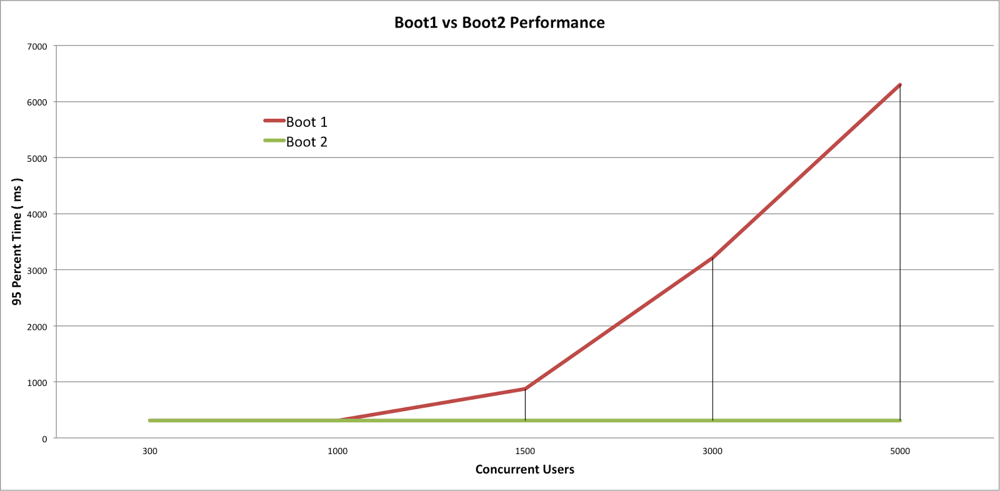

Spring WebFlux는 왜 빠를까?
====================================

Spring Webflux는 non-blocking I/O를 통해 적은 resources로 동시성을 구현하는 패러다임이다.

Spring Boot1 과 Spring Boot2의 동시 접속자 별 응답시간을 비교한 차트를 보면 동시 접속자가 적을 때는 비슷하다가 1000 Client 이상이 넘어가면 차이가 나는 것을 볼 수 있다. 



이 이유를 이해하기 위해서 아래 흐름을 따라가보자.

1. I/O
2. Event-Driven
3. Spring Framework


# I/O
I/O에는 아래와 같은 세 가지 패러다임이 있다.

## Blocking I/O
기본적은 I/O 모델로 Application은 I/O 작업을 요청하는 순간부터 I/O 응답을 받는 순간까지 blocked되는 패러다임이다. 이 문제를 해결하기 위해서 멀티 스레드 방식의 Application이 동작하는데 요청하는 스레드가 기다리는 동안 다른 스레드를 동작시켜 동시성을 확보한다. 다만 이 방식은 스레드 간 context switching이 자주 발생하여 성능상 비효율적이다.


## Synchronous Non-Blocking I/O
Application에서 I/O 요청 후 바로 return되어 다른 작업을 수행하다가 특정 시간마다 데이터가 준비되었는지 확인하는 로직이다. 데이터 준비가 끝날 때까지 틈틈이 확인을 하다가 완료가 되었으면 종료한다.

주기적으로 폴링하는 작업 또한 불필요한 자원소비가 일어난다.

## Asynchronous Non-Blocking I/O
I/O 요청을 한 후 Non-Blocking I/O와 마찬가지로 즉시 리턴된다. 데이터가 준비되면 이벤트 완료 시그널을 보내거나 callback을 통해서 이후 작업이 진행된다. 

# Event Driven

Event-Driven Programming은 프로그램 실행 흐름이 이벤트에 의해 결정되는 프로그래밍 패러다임이다. 
Event가 발생할 때 이를 감지하고 바인딩된 이벤트 핸들러를 사용하여 로직이 실행되도록 설계되었다. 

아래는 java를 이용하여 Click Event를 구현한 예이다.

```java
JButton button = new JButton();
button.addActionListener(e -> System.out.println("clicked"));
```

Java 뿐만 아니라 다른 언어도 이런 방식으로 Listener에 이벤트 핸들러 로직을 등록할 수 있다. 그런데 Button은 어떻게 유저에 의해 Click이 되었는지 인지할 수 있을까? 

C언어로 돌아가 이 방식이 어떻게 구현되었을지 예측해보자.

```C
int main(void){
    char key;
    while(1){
        key = getch();      // (1) 

        switch (key) {      // (2)
            case 1 : 실행문; break;
            case 2 : 실행문; break;
            case 3 : 실행문; break;
            case 4 : 실행문; break;
            default : 실행문; break;
        }
    }
    return 0;
}
```

위 코드는 무한루프를 돌면서 사용자에 의해 key가 눌러지는 것을 감지하고 감지된 값을 토대로 해야 할 일을 알맞은 곳에서 처리한다.

이를 추상화시키면 아래와 같은 로직이 나온다.

```
Event Loop를 돌면서 Event를 감지한 뒤 Event Handler 또는 Event Listener에게 보내 작업을 처리한다.
```

일일이 Event를 제어했던 과거와는 달리 요즘은 이를 단순히 Listener에 행위만 등록해주면 간편하게 Event를 제어할 수 있다. 이는 Event Handle만이 관심의 대상이고 이에 집중할 수 있게 한다. 달리 말하면 Evevt Loop를 돌면서 요청을 감지하고 적합한 Handler에 위임해주는 부수적인 부분은 언어 레벨에서 처리를 해준다는 말이다.

이러한 Event 처리는 Server에도 적합하다. 왜냐하면 HTTP Request라는 Event가 발생하기 때문이다. 그래서 Node.js, Spring WebFlux, Vert.x 등은 Event-Driven 형태로 Architecture가 구현되어있다.

# Spring Framework

Spring은 HTTP Request 처리를 위해 Reactvie Stack과 Servelt Stack 모델을 제공한다.

Servelt Stack 모델은 HTTP 요청 마다 Thread가 하나씩 붙어서 처리하는 방법이다. Thread Pool에 저장된 스레드 수를 넘어서는 요청이 들어오면 잠시 대기하게 되는데, 이 요청 수가 많아질수록 대기 시간이 길어질 수 밖에 없다.

Spring WebFlux는 이전 세션에서 알아봤던 Non-blocking I/O 와 Event Driven 매커니즘을 차용해서 소수의 worker thread가 이벤트 루프를 통해서 요청을 처리한다. 

WebFlux로 성능을 최대치로 끌어올리려면 모든 I/O 작업이 Non Blocking 기반으로 동작해야 된다. 

기본적으로 Thread Pool이 감당할 수 있는 수준, 서버당 처리해야하는 동시 처리량이 1000건이 넘지 않으면 기존 MVC 모델을 사용하는게 생산성 측면에서 이득이고 더 좋은 성능이 필요할 때 Webflux를 검토해볼 수 있다.