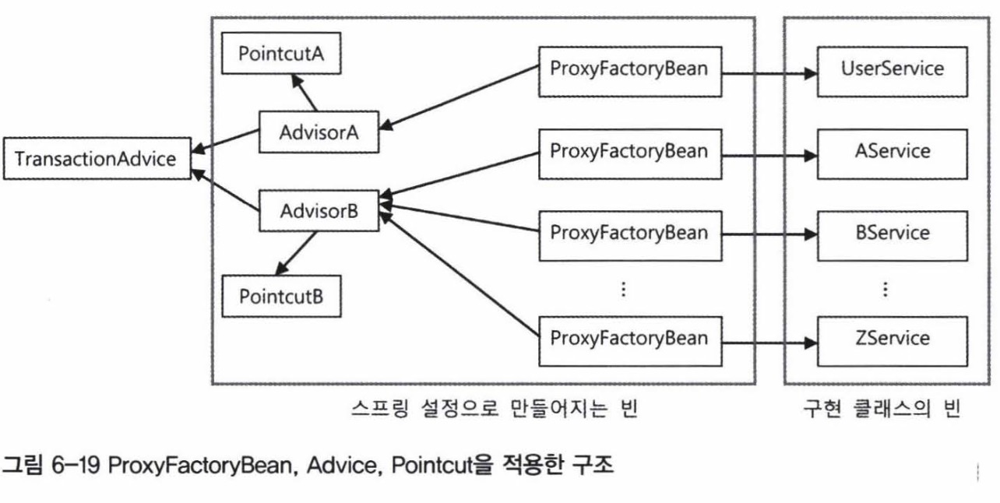

# 6.4.1 ProxyFactoryBean
- 스프링에서는 스프링 빈으로 등록할 수 있는 프록시 생성을 위한 ProxyFactoryBean이라는 팩토리 빈을 제공한다.
- 전에 만든 TxProxyFactoryBean과 달리 ProxyFactoryBean은 순수하게 프록시 생성만을 담당한다.
- ProxyFactoryBean은 기존 InvocationHandler 대신 MethodInterceptor 인터페이스를 구현해서 만든다. 
	- InvocationHandler의 invoke()는 타깃 오브젝트 정보를 갖고 있지 않으므로 타깃이 InvocationHandler를 구현한 클래스를 알고 있어야 한다.
	- MethodInterceptor은 ProxyFactoryBean으로부터 타깃 오브젝트에 대한 정보를 제공 받아 사용할 수 있어 각각 독립적으로 만들어질 수 있으며 다른 여러 타깃에 적용이 가능하며 싱글톤 빈으로 등록이 가능하다.
```
package springbook.learningtest.jdk.proxy; 
public class DynamicProxyTest { 
	@Test 
	public void simpleProxy() {
		Hello proxiedHello = (Hello)Proxy.newProxyInstance( 
			getClass().getClassLoader(),  
			new Class[] { Hello.class}, 
			new UppercaseHandler(new HelloTarget()));
			...
	}

	@Test 
	public void proxyFactoryBean() { 
		ProxyFactoryBean pfBean = new ProxyFactoryBean(); 
		pfBean.setTarget(new HelloTarget()); 
		pfBean.addAdvice(new UppercaseAdvice()); 
 
		Hello proxiedHello = (Hello) pfBean.getObject(); 
   
		assertThat(proxiedHello.sayHello("Toby"), is("HELLO TOBY")); 
		assertThat(proxiedHello.sayHi("Toby"), is("HI TOBY")); 
		assertThat(proxiedHello.sayThankYou("Toby"), is("THANK YOU TOBY")); 
	} 
  
	static class UppercaseAdvice implements MethodInterceptor { 
		public Object invoke(MethodInvocation invocation) throws Throwable { 
			String ret = (String)invocation.proceed(); 
			return ret.toUpperCase(); 
		} 
	}  
  
	static interface Hello { 
		String sayHello(String name); 
		String sayHi(String name); 
		String sayThankYou(String name); 
	} 

	static class HelloTarget implements Hello { 
		public String sayHello(String name) { 
			return "Hello " + name; 
		} 

		public String sayHi(String name) { 
			return "Hi " + name; 
		} 

		public String sayThankYou(String name) { 
			return "Thank You " + name; 
		} 
	} 
}
```
### 어드바이스: 타깃이 필요 없는 순수한 부가기능
- MethodInvocation은 일종의 콜백 오브젝트로, proceed() 메소드를 실행하면 타깃 오브젝트의 메소드를 내부적으로 실행해준다.
- 수정자 메소드 대신 addAdvice라는 메소드로 여러개의 MethodInterceptor를 추가할 수 있다. 새로운 부가기능을 추가할 때마다 프록시와 프록시 팩토리 빈을 추가할 필요가 없어졌다.
- MethodInterceptor 오브젝트는 addAdvice()를 통해 추가 되며 MethodInterceptor는 Advice 인터페이스를 상속하고 있는 서브인터페이스이다.
- 기존과 달리 Hello라는 인터페이스르 제공해주는 부분이 없다. 이는 ProxyFactoryBean의 인터페이스 자동검출 기능을 통해오브젝트가 구현하고 있는 인터페이스 정보를 가져와 모든 인터페이스에 대한 프록시를 만들어주기 때문이다. 그리고 프록시를 추가하거나 필요한 인터페이스에 대한 프록시만 제공하도록 설정할 수도 있다.

### 포인트컷: 부가기능 적용 대상 메소드 선정 방법
- TxProxyFactoryBean에서 pattern이라는 메소드 이름 비교용 스트링 값을 받아서 이용했으나 ProxyFactoryBean과 MethodInterceptor에서는 여타 프록시들과 다 같이 이용되고 있어 이런 주입은 불가하다.
- 지금은 InvocationHandler가 부가기능과 부가기능 메소드 선정이라는 두가지 책임을 가지고 있다. 이를 다음과 같이 템플릿/콜백 구조로 만들어보자. 여기서 템플리스은 advice이고 MethodInvocation 오브젝트가 콜백이다.


```
@Test
public void pointcutAdvisor() {
	ProxyFactoryBean pfBean = new ProxyFactoryBean();
	pfBean.setTarget(new HelloTarget());

	NameMatchMethodPointcut pointcut = new NameMatchMethodPointcut();
	pointcut.setMappedName("sayH*");

	//포인트컷과 어드바이스를 Advisor로 묶어서 한번에 추가
	pfBean.addAdvisor(new DefaultPointcutAdvisor(pointcut, new UppercaseAdvice()));
	Hello proxiedHello = (Hello) pfBean.getObject();

	assertThat(proxiedHello.sayHello(name), is("HELLO TOBY"));
    assertThat(proxiedHello.sayHi(name), is("HI TOBY"));
    assertThat(proxiedHello.sayThankYou(name), is("Thank You Toby"));
}
```
- advisor = pointcut(메소드 선정) + advice(부가기능)

## 6.4.2 ProxyFactoryBean 적용
### TransactionAdvice
```
package springbook.user.service;
public class TransactionAdvice implements MethodInterceptor {
    PlatformTransactionManager transactionManager;

    public void setTransactionManager(PlatformTransactionManager transactionManager) {
        this.transactionManager = transactionManager;
    }

    @Override
    public Object invoke(MethodInvocation methodInvocation) throws Throwable {
        TransactionStatus status = this.transactionManager.getTransaction(new DefaultTransactionDefinition());

        try {
            Object ret = methodInvocation.proceed();
            this.transactionManager.commit(status);
            return ret;
        } catch (RuntimeException e) {
            this.transactionManager.rollback(status);
            throw e;
        }
    }
}
```
```
@Test
@DirtiesContext // 컨텍스트 무효화 애노테이션
public void upgradeAllOrNothing() throws Exception {
	TestUserService testUserService = new TestUserService(users.get(3).getId());
	testUserService.setUserDao(this.userDao);
	testUserService.setUserLevelUpgradePolicy(this.userLevelUpgradePolicy);

	ProxyFactoryBean txProxyFactoryBean = context.getBean("&userService", ProxyFactoryBean.class);
	txProxyFactoryBean.setTarget(testUserService);

	UserService txUserService = (UserService) txProxyFactoryBean.getObject();
}
```
