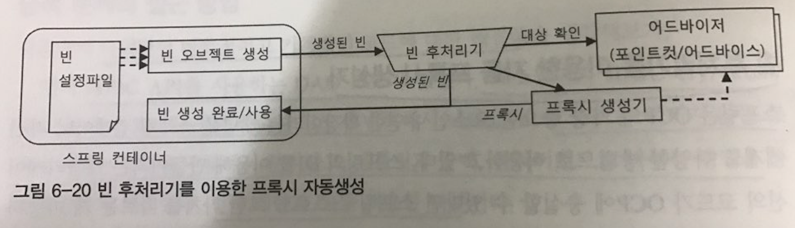
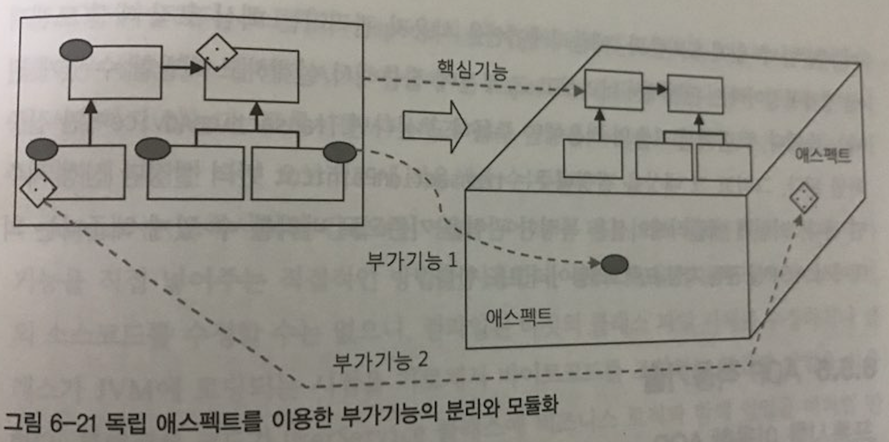

# 6.5 스프링 AOP
- 중복 설정 제거를 위한 자동 프록시 설정
- 간단하고 효과적인 클래스와 메소드 선정 알고리즘 : 포인트 컷
- UserService에 트랜잭션을 어떻게 적용했는가 ?
- AOP란 무엇인가 ?


## 중복 설정 제거를 위한 자동 프록시 설정

- 지금까지 다뤄봤던 반복적이고 기계적인 코드에 대한 해결책

  1. JDBC API를 사용하는 DAO 코드.
    - > 메소드마다 JDBC try/catch/finally 블록으로 구성된 비슷한 코드가 반복
    - > 바뀌지 않는 부분과 바뀌는 부분을 구분해서 분리
    - > 템플릿과 콜백, 클라이언트로 나눠서 DI를 구현

  2. 반복적인 위임 코드가 필요한 프록시 클래스 코드
    - > 타깃 오브젝트로의 위임 코드와 부가 기능 적용을 위한 코드가 인터페이스를 구현하는 프록시마다 반복
    - > 다이내믹 프론시라는 런타임 코드 자동생성 기법을 이용


```
 반복적인 프록시의 메소드 구현을 코드 자동생성 기법을 이용해 해결했다면 반복적인 ProxyFactoryBean 설정 문제도 해결할 수 있을까?
```

### 빈 후처리기를 이용한 자동 프록시 생성기
- 스프링은 컨테이너로서 제공하는 기능 중에서 변하지 않는 핵심적인 부분외에는 대부분 확장할 수 있도록 확장 포인트를 제공
- DefaultAdvisorAutoProxyCreator는 BeanPostProcessor 인터페이스를 구현한 빈 후처리기

*DefaultAdvisorAutoProxyCreator*

어드바이저를 이용한 자동 프록시 생성기다. 이 빈 후처리그를 스프링에 적용하는 방법은 간단하다. 빈 후처리기 자체를 빈으로 등록하는 것이다.
스프링은 빈 후처리가 빈으로 등록되어 있으면 빈 오브젝트가 생성될 때마다 빈 후처리기에 보내서 후처리 작업을 요청한다.

```
이를 잘 이용하면 스프링이 생성하는 빈 오브젝트의 일부를 프록시로 포장하고, 프록시를 빈으로 대신 등록할 수도 있다.
```

  


```
  1. DefaultAdvisorAutoProxyCreator 빈 후처리기가 등록되어 있으면 스프링은 빈 오브젝트를 만들 때마다 후처리기에게 빈을 보낸다.
  2. DefaultAdvisorAutoProxyCreator는 빈으로 등록된 모든 어드바이저 내의 포인트컷을 이용해 전달받은 빈이 프록시 적용 대상인지 확인한다.
  3. 프록시 적용 대상이면 그때는 내장된 프록시 생성기에게 현재 빈에 대한 프록시를 만들게 하고, 만들어진 프록시에 어드바이저를 연결해준다.
  4. 빈 후처리기는 프록시가 생성되면 원래 컨테이너가 전달해준 빈 오브젝트 대신 프록시 오브젝트를 컨테이너에게 돌려준다.
  5. 컨테이너는 최종적으로 빈 후처기가 돌려준 오브젝트를 빈으로 등록하고 사용한다.
```

### 확장된 포인트컷
- 지금까지 포인트컷이란 타깃 오브젝트의 메소드 중에서 어떤 메소드에 부가기능을 적용할지를 선정해주는 역할을 했다.
- 위 설명에서는 '포인트컷을 이용해 전달받은 빈'이 라는 말이 나온다.
- 빈 오브젝트 자체를 선별하는 기능은 어떻게 가능할까?

```
  포인트 컷은 클래스 필터와 메소드 매처 두가지를 돌려주는 메소드를 가지고 있다.
```


```java
public interface Pointcut {
    ClassFilter getClassFilter(); //-> 프록시를 적용할 클래스인지 확인해준다.
    MethodMatcher getMethodMatcher(); //-> 어드바이스를 적용할 메소드인지 확인해준다.
}
```

### 클래스 필터를 적용한 포인트컷 작성
- 메소드 이름만 비교하던 포인트컷인 NameMatchMethodPointcut을 상속해서 프로퍼티로 주어진 이름 패턴을 가지고 클래스 이름을 비교하는 ClassFilter를 추가하도록 만듦


*클래스필터가 포함된 포인트컷 구현*

```java
public class NameMatchClassMethodPointcut extends NameMatchMethodPointcut {
    public void setMappedClassName(String mappedClassName){
        this.setClassFilter(new SimpleClassFilter(mappedClassName));
    }

    static class SimpleClassFilter implements ClassFilter{
        String mappedName;

        private SimpleClassFilter(String mappedName){
            this.mappedName = mappedName;
        }

        public boolean matches(Class<?> clazz){
            return PatternMatchUtils.simpleMatch(mappedName,clazz.getSimpleName());
        }
    }
}
```

*포인트컷 빈*

```xml
    <bean id="transactionPointcut" class="chap1.springbook.user.service.NameMatchClassMethodPointcut">
        <property name="mappedClassName" value="*ServiceImpl"/>
        <property name="mappedName" value="upgrade*"/>
    </bean>
```

```
이제는 ProxyFactoryBean으로 등록한 빈에서처럼 TransactionAdvisor를 명시적으로 DI하는 빈은 존재하지않는다.
```

## 간단하고 효과적인 클래스와 메소드 선정 알고리즘 : 포인트 컷
: 지금까지 사용했던 포인트컷은 메소드의 이름과 클래스의 이름 패턴을 각각 클래스 필터와 메소드 매처 오브젝트로 비교해서 선정하는 방식이었다. 단순한 이름 비교하는 일이 전부였다.

- 리플렉션 API를 이용하면 클래스와 메소드의 이름, 정의된 패키지, 파라미터 리턴 값은 물론 부여된 애노테이션이나 구현한 인터페이스, 상속한 클래스 등의 정보까지도 알아낼 수 있다.
- 스프링은 아주 간단하고 효과적인 방법으로 포인트컷의 클래스와 메소드를 선정하는 알고리즘을 작성할 수 있는 방법을 제공한다.

### 포인트컷 표현식
- 스프링이 사용하는 포인트컷 표현식은 AspectJ라는 유명한 프레임워크에서 제공하는 것을 가져와 일부 문법을 확장해서 사용하는 것이다.

*AspectJExpressionPointcut은 클래스와 메소드의 선정 알고리즘을 포인트컷 표현식을 이용해 한 번에 지정할 수 있게 해준다.*

### 포인트컷 표현식 문법

```
포인트 컷 지시자 중 가장 대표적으로 사용되는 것은 excution()이다.

*지시자: AspectJ에서 포인트컷을 표현하는 방법을 지시하는 개념
```

```java
                       //리턴값           //메소드   //파라미터
excution([접근 제한자 패턴] 타입패턴 [타입패턴.] 이름패턴 (타임패턴 | "..", ...) [throws 예외 패턴])
                               //패키지와 클래스
```

excution 지시자의 기분 문법 구조.

[] 괄호는 옵션항목

| 는 OR 조건


리플렉션으로 Target 클래스의 Minus 메소드의 풀 시그니처를 가져와서 비교해보자.

```
System.out.println(Target.class.getMethod("minus", int.class, int.class));

// public int springbook.learningtest.spring.pointcut.Target.minus(int, int) throws java.lang.RuntimeException
```

기존 포인트 컷 빈의 프로퍼티 선언에 담긴 포인트컷 선정조건을 포인트컷 표현식을 이용해서 변경해부자.

```xml
    //<bean id="transactionPointcut" class="chap1.springbook.user.service.NameMatchClassMethodPointcut">
    <bean id="transactionPointcut" class="org.springfreamwork.aop.aspectj.AspectJExpressionPointcut">
        //<property name="mappedClassName" value="*ServiceImpl"/>
        //<property name="mappedName" value="upgrade*"/>
        <property name="expression" value="excution(* *..*ServiceImpl.upgrade*(..))"/>
    </bean>
```

## UserService에 트랜잭션을 어떻게 적용했는가 ?

### 트랜잭션 서비스 추상화
```
트랜잭션 관련 코드를 비즈니스 코드로부터 분리.

인터페이스와 DI를 통해 무엇을 하는지는 남기고 그것을 어떻게 구현하는지는 분리하여 로컬 트랜잭션 방식이든, 글로벌/분산 트랜잭션 방식이든 트랜잭션 방식이 변경되어도 비즈니스 로직은 변경되지 않게 수정
```

### 프록시와 데코레이터 패턴
```
어떻게 다룰 것인가만 추상화되어 분리되었지만, 여전히 코드에는 트랜잭션 코드가 노출.

데코레이터 패턴을 이용해서 비즈니스 로직을 담당하는 클래스와 트랜잭션을 담아주는 프록시 클래스를 분리
```

### 다이나믹 프록시와 프록시 팩토리 빈
```
코드는 모두 제거되었지만 비즈니스 로직 인터페이스의 모든 메소드마다 트랜잭션 기능을 부여하는 코드를 넣어 프록시 클래스를 만드는 작업이 오히려 큰 짐.

트랜잭션 기능을 부여하지 않아도 되는 메소드조차 프록시로서 위임 기능이 필요하기 때문에 일일이 다 구현을 해줘야함.

프록시 클래스 없이도 프록시 오브젝트를 다이나믹하게 만들어주는 JDK 다이내믹 프록시 기술 적용

```

### 자동 프록시 생성 방법과 포인트 컷
```
트랜잭션 적용 대상이 되는 빈마다 일일이 프록시 팩토리 빈을 설정해줘야 한다는 부담이 있음.

스프링의 컨테이너 빈 생성 후처리 기법을 활용해 컨테이너 초기화 시점에 포인트 컷을 이용해서 메소드를 선정하고 어드바이스를 넣어줌.
```

### 부가기능의 모듈화
```
트랜잭션 같은 부가기능은 핵심기능과 같은 방식으로는 모듈화하기가 매우 힘들다.
이름 그대로 부가기능이기 때문에 스스로 독립적인 방식으로 존재해서는 적용되기 어렵기 때문이다. 트랜잭션 부가기능이란 트랜잭션 기능을 추가해줄 다른 대상, 즉 타깃이 존재해야만 의미가 있다.
```


## AOP란 무엇인가?
- 전통적인 객체지향 기술의 설계방법으로는 독립적인 모듈화가 불가능한 트랜잭션과 같은 부가기능들의 대두
- 새로운 설계 패러다임이 필요함.
- 애플리케이션의 핵심기능을 담고 있지는 않지만, 관점에 따라 필요한 모듈을 Aspect라 부름.



```
AOP는 핵심적인 기능에서 부가적인 기능을 분리해서 에스펙트라는 독특한 모듈로 만들어서 설계하고 개발하는 방법

* AOP는 OOP를 돕는 보조적인 기술이지 OOP를 완전히 대체하는 새로운 개념은 아니다.
```

### AOP 적용 기술
- 프록시를 이용한 AOP
  - 스프링은 IoC/DI 컨테이너와 다이내믹프록시, 데코레이터 패턴, 프록시 패턴, 자동 프록시 생성기법, 빈 오브젝트 후처리 조작 기법등을 조합해 AOP 지원
  - 그 중 가장 핵심은 프록시를 이용했다는 것.

- 바이트 코드 생성과 조작을 통한 AOP
  - AspectJ는 컴파일된 타킷의 클래스 파일 자체를 수정하거나 클래스가 JVM에 로딩되는 시점을 가로채서 바이트 코드를 조작하는 방법을 사용
  - 스프링과 같은 컨테이너가 사용되지 않는 환경에서도 손쉽게 AOP 적용이 가능
  - 바이트코드를 직접 조작하기 때문에 오브젝트의 생성, 필드값의 초기화와 같은 유연한 조작이 가능.

### AOP 용어

◎ Advice : 언제 무엇을 할지 나타냅니다. 즉 애스펙트가 해야하는 작업과 언제 그 작업을 수행해야 하는지를 정의한 것이 어드바이스 입니다. (실제로 Target 객체에 적용할 일을 나타냄.)

◎ Joinpoint : Advice를 적용할 시점을 말합니다. (생성자 호출, 필드에 접근, 필드의 값 변셩, 메소드 호출등의 시점.) Spring AOP는 메소드 호출 Joinpoint만 지원합니다.

◎ Pointcut : Joinpoint의 부분집합으로 애스펙트가 어드바이스 할 조인포인트의 영역을 좁히는 일을합니다.

◎ Advisor : 하나의 Advice와 하나의 Piontcut을 묶은 것. Aspect는 여러개의 Advice와 Pointcut을 가지고 있는 것을 말합니다. 즉 Advisor도 하나의 Advice와 Pointcut을 가지고 있는 Aspect라고 할 수 있습니다.

◎ Aspect : Advice + Pointcut
어드바이스와 포인트컷을 합친 것이 애스펙트 입니다. 두가지 정보가 합쳐지면 애스팩트가 무엇을 언제해야할지, 즉 애스펙트에 필요한 모든 정보가 정의됩니다.

◎ Introduction : 기존 클래스의 코드 변경 없이도 새 메소드나 멤버변수를 추가하는 기능입니다.

◎ Target : Advice의 대상이 되는 객체를 말합니다.

◎ Proxy : 프록시 객체
Spring AOP는 Proxy객체를 사용합니다. 프록시는 어드바이스를 타깃 객체에 적용하면 생성되는 객체입니다.


### AOP 네임스페이스
- 스프링의 프록시 방식 AOP를 사용하려면 아래 네 가지 빈은 무조건 등록해야 한다
  1. 자동 프록시 생성기
  2. 어드바이스
  3. 포인트컷
  4. 어드바이저

- 스프링에서는 이렇게 AOP를 위해 기계적으로 적용하는 빈들을 간편한 방법으로 등록할 수 있다.


```xml
<?xml version="1.0" encoding="UTF-8"?>
<beans xmlns="http://www.springframework.org/schema/beans"
	xmlns:xsi="http://www.w3.org/2001/XMLSchema-instance"
	xmlns:aop="http://www.springframework.org/schema/aop"
	xsi:schemaLocation="http://www.springframework.org/schema/aop http://www.springframework.org/schema/aop/spring-aop-3.1.xsd
		http://www.springframework.org/schema/beans http://www.springframework.org/schema/beans/spring-beans.xsd">

	<!-- pointcut -->
	<bean id="transactionPointcut"
		class="kinow.spring.test.proxy.auto.NameMatchClassMethodPointcut">
		<property name="mappedClassName" value="*ServiceImpl" />
		<property name="mappedName" value="upgrade*" />
	</bean>
	<!-- extended pointcut -->
	<bean id="transactionPointcutAspecJ" class="org.springframework.aop.aspectj.AspectJExpressionPointcut">
		<property name="expression" value="execution(* *..*ServiceImpl.upgrade*(..))"/>
	</bean>

	<!-- Advisor -->
	<bean id="transactionAdvisor"
			class="org.springframework.aop.support.DefaultPointcutAdvisor">
		<property name="advice" ref="transactionAdvice" />
		<property name="pointcut" ref="transactionPointcutAspecJ" />
	</bean>

</beans>
```
