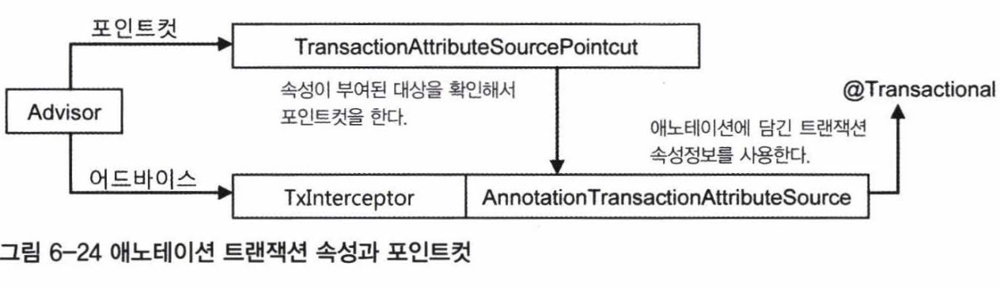
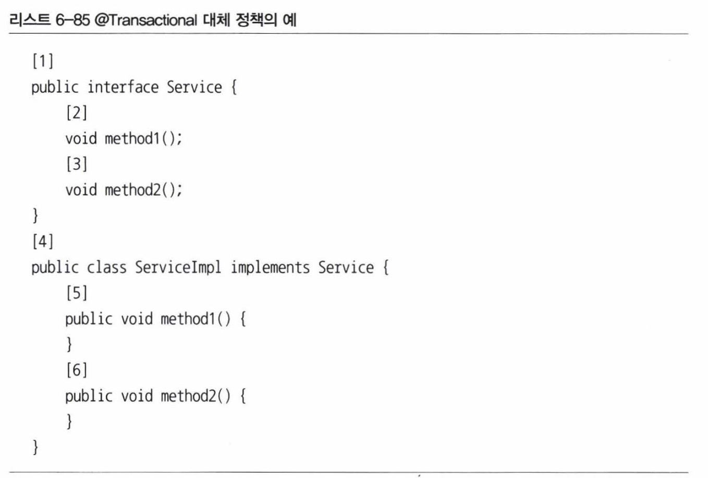

# 6.7 애노테이션 트랜잭션 속성과 포인트컷
- 포인트컷 표현식과 트랜잭션 속성을 이용해 트랜잭션을 일괄적으로 적용하는 방식은 복잡한 트랜잭션 속성이 요구되지 않는 대부분의 상황에 잘 들어맞는다.
- 그런데 클래스나 메소드에 따라 제각각 속성이 다른 세밀하게 튜닝된 트랜잭션 속성을 적용해야하는 경우에는 어떻게 해야할까? 이런때를 위해 스프링이 제공해주는 것이 트랜잭션 애노테이션이다.

## 트랜잭션 애노테이션
- 필요에 따라 애노테이션 정의를 읽고 그 내용과 특징을 이해할 수 있도록 애노테이션 정의에 사용되는 주요 메타애노테이션을 알고 있어야 한다.

### @Transactional
```java
// 애노테이션을 사용할 대상을 지정한다. 여기에 사용된 메서드와 타입(클래스, 인터페이스)처럼 한 개 이상의 대상을 지정할 수 있다.
@Target({ElementType.METHOD, ElementType.TYPE})
// 애노테이션 정보가 언제까지 유지되는지를 지정한다. 이렇게 설정하면 런타임 때도 애노테이션 정보를 리플렉션을 통해 얻을 수 있다.
@Retention(RetentionPolicy.RUNTIME)
@Inherited //상속을 통해서도 애노테이션 정보를 얻을 수 있게 한다.
@Documented
public @interface Transactional {
    @AliasFor("transactionManager")
    String value() default "";
    @AliasFor("value")
    String transactionManager() default "";
    Propagation propagation() default Propagation.REQUIRED;
    Isolation isolation() default Isolation.DEFAULT;
    int timeout() default -1;
    boolean readOnly() default false;
    Class<? extends Throwable>[] rollbackFor() default {};
    String[] rollbackForClassName() default {};
    Class<? extends Throwable>[] noRollbackFor() default {};
    String[] noRollbackForClassName() default {};
}
```
- @Transactional 애노테이션 타킷은 메소드와 타입이다. 따라서 `메소드`, `클래스`, `인터페이스`에 사용할 수 있다.
- @Transactional이 부여된 모든 오브젝트를 자동으로 타깃 오브젝트로 인식한다. 이때 사용되는 포인트컷은 TransactionAttributeSourcePointcut이다. TransactionAttributeSourcePointcut은 스스로 표현식과 같은 선정기준을 갖고 있진 않다. 대신 @Transactional이 타입 레벨이든 메서드 레벨이든 상관없이 부여된 빈 오브젝트를 모두 찾아서 포인트컷의 선정 결과로 돌려준다.
- @Transactional 은 기본적으로 트랜잭션 속성 정의를 하는 것이지만, 동시에 포인트컷의 자동 등록에도 사용된다.

### 트랜잭션 속성을 이용하는 포인트컷
- 아래 그림은 @Transactional 애노테이션을 사용했을 때 어드바이저의 동작방식을 보여준다. TransactionInterceptor 는 메서드 이름 패턴을 통해 부여되는 일괄적인 트랜잭션 속성정보 대신 @Transactional 애노테이션의 엘리먼트에서 트랜잭션 속성을 가져오는 AnnotationTransactionAttributeSource를 사용한다. @Transactional은 메서드마다 다르게 설정할 수도 있으므로 매우 유연한 트랜잭션 속성 설정이 가능해진다.
- 동시에 포인트컷도 @Transactional을 통한 트랜잭션 속성정보를 참조하도록 만든다. @Transactional로 트랜잭션 속성이 부여된 오브젝트라면 포인트컷의 선정 대상이기도 하기 때문이다. 이 방식을 이용하면 포인트컷과 트랜잭션 속성을 애노테이션 하나로 지정할 수 있다. 트랜잭션 속성은 타입 레벨에 일괄적으로 부여할 수도 있지만, 메서드 단위로 세분화해서 트랜잭션 속성을 다르게 지정할 수도 있기 때문에 매우 세밀한 트랜잭션 속성 제어가 가능해진다.



### 대체 정책
- 동일한 속성 정보를 가진 애노테이션을 메소드마다 부여해주는 비효율을 막기위해 스프링은 4단계의 대체 정책을 이용하게 해준다.
- 메소드의 속성을 확인할 때, `타깃 메소드`, `타깃 클래스`, `선언 메소드`, `선언 타입(클래스, 인터페이스)`의 순서에 따라 @Transactional 이 적용되었는지 차례로 확인하고 가장 먼저 발견되는 속성 정보를 사용하게 하는 방법이다.



- 위와 같이 정의된 인터페이스와 구현 클래스가 있다고 하자. @Transactional을 부여할 수 있는 위치는 총 6개다. 스프링은 트랜잭션 기능이 부여될 위치인 타깃 오브젝트의 메서드부터 시작해서 @Transactional 애노테이션이 존재하는지 확인한다.
- 기본적으로 @Transactional 적용 대상은 클라이언트가 사용하는 인터페이스가 정의한 메서드이므로 @Transactional도 타깃 클래스보다는 인터페이스에 두는 게 바람직하다. 하지만 인터페이스를 사용하는 프록시 방식의 AOP가 아닌 다른 방식으로 트랜잭션을 적용하면 인터페이스에 정의한 @Transactional은 무시되기 때문에 안전하게 타깃 클래스에 @Transactional을 두는 방법을 권장한다.

### 트랜잭션 애노테이션 사용을 위한 설정
- @Transactional 을 이용한 트랜잭션 속성을 사용하는데 필요한 설정은 매우 간단하다.
- 스프링이 이 방법을 위한 모든 설정을 다음 태그 하나에 담아뒀기 때문이다.

```xml
<tx:annotation-driven />
```

- Java Config 방식은 아래와 같이 선언한다.

```java
@EnableTransactionManagement
```

## 트랜잭션 애노테이션 적용
- @Transactional 을 UserService 에 적용해보자.

```java
@Transactional //<tx:method name="*" />과 같은 효과를 주며, 모든 메서드에 기본 적용된다.
public interface UserService {
    void add(User user);
    void deleteAll();
    void update(User user);
    void upgradeLevels();

    //<tx:method name="get*" read-only="true" /> 를 애노테이션 방식으로 변경한 것이다.
    //인터페이스 선언한 @Transactional 보다 우선순위가 높다.
    @Transactional(readOnly=true)
    User get(String id);
    @Transactional(readOnly=true)
    List<User> getAll();
}
```
