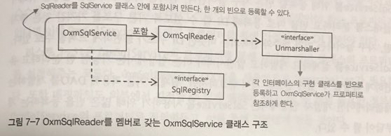
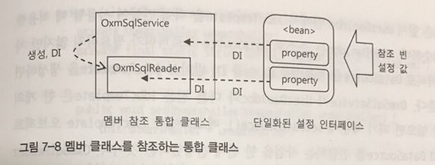
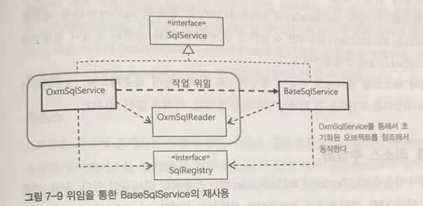

## 7.3 서비스 추상화 적용
- 자바에서는 JAXB 외에도 다양한 XML 자바오브젝트 매핑 기술을 제공한다. 이를 이용해 보자.
- XML 파일을 좀 더 다양한 소스에서 가져와보자.

### 7.3.1 OXM 서비스 추상화
- OXM(Object-XML Mapping): XML과 자바오브젝트를 매핑해서 상호 변환해주는 기술
```
	- Castor XML: 설정파일이 필요 없는 인트로스펙션 모드를 지원하기도 하는 매우 간결하고 가벼운 바인딩 프레임워크

	- JiBX: 뛰어난 퍼포먼스를 자랑하는 XML 바인딩 기술

	- XmlBeans: 아파치 XML 프로젝트의 하나. XML 정보셋을 효과적으로 제공

	- Xstream: 관례를 이용해서 설정이 없는 바인딩을 지원하는 XML 바인딩 기술
```
#### OXM 서비스 인터페이스
- Marshaller: 자바오브젝트 -> XML
- Unmarshaller: XML -> 자바오브젝트

#### JAXB 구현 테스트
- Jaxb2Marshaller에 Marshaller/Unmarshaller가 모두 들어있다.
- Unmarshaller는 supports라는 메소드로 언마셜이 가능한지 판단하고 unmarshall이라는 메소드로 source코드를 통해 제공받은 XML을 자바오브젝트 트리로 변환해서 루트를 반환한다.
- 단순히 unmarshaller를 빈으로 등록하여 contextPath에 설정만 해주면 끝난다.
```
package springbook.learningtest.spring.oxm;
...
import org.springframework.oxm.Unmarshaller;
import javax.xml.transform.stream.StreamSource;

@RunWith(SpringJUnit4ClassRunner.class)
@ContextConfiguration
public class OxmTest {

    @Autowired private Unmarshaller unmarshaller;

    @Test
    public void unmarshallSqlMap() throws Exception {
        Source xmlSource = new StreamSource(getClass().getResourceAsStream("sqlmap.xml"));

        Sqlmap sqlmap = (Sqlmap) this.unmarshaller.unmarshal(xmlSource);

        List<SqlType> sqlList = sqlmap.getSql();
        assertThat(sqlList.size(), is(3));
        assertThat(sqlList.get(0).getKey(), is("add"));
        assertThat(sqlList.get(2).getKey(), is("delete"));
    }
}
```

#### Castor 구현 테스트
- 간단한 Mapping 기능을 구현해보자.
- 다음과 같이 mapping.xml을 만들고 CastorMarshaller라는 빈을 생성하여 mappingLocation 필드에 이 XML 위치를 넣어주면 된다.
```
<?xml version="1.0" encoding="UTF-8"?>
<!DOCTYPE mapping PUBLIC "-//EXOLAB/Castor Mapping DTD Version 1.0//EN"
        "http://castor.org/mapping.dtd">
<mapping>
    <class name="net.woniper.tdd.toby.chapter7.service.jaxb.Sqlmap">
        <map-to xml="sqlmap" />
        <field name="sql" type="net.woniper.tdd.toby.chapter7.service.jaxb.SqlType"
               required="true" collection="arraylist">
            <bind-xml name="sql" node="element"/>
        </field>
    </class>

    <class name="net.woniper.tdd.toby.chapter7.service.jaxb.SqlType">
        <map-to xml="sql" />
        <field name="key" type="string" required="true">
            <bind-xml name="key" node="attribute"/>
        </field>
        <field name="value" type="string" required="true">
            <bind-xml node="text"/>
        </field>
    </class>
</mapping>
```


### 7.3.2 OXM 서비스 추상화 적용
- SQL을 읽는 방법을 OXM으로 제한해서 사용성을 극대화 해보자(SqlReader를 스프링 OXM 언마셜러를 이용하도록 OxmSqlService에 고정)

#### 멤버 클래스를 참조하는 통합 클래스

- final 인스턴스와 private 메소드로 변경의 여지를 없애는 다음과 같은 코드를 작성한다.
```
package springbook.user.sqlservice;

public class OxmSqlService implements SqlService {
    private final OxmSqlReader oxmSqlReader = new OxmSqlReader();
    ...
    public void setUnmarshaller(Unmarshaller unmarshaller) {
        this.unmarshaller = unmarshaller;
    }

    public void setSqlmapFile(String sqlmapFile) {
        this.sqlmapFile = sqlmapFile;
    }

    private class OxmSqlReader implements SqlReader {
        private Unmarshaller unmarshaller;
        private String sqlmapFile;
        // setter method 생략
        ...
    }
}
```


```
package springbook.user.sqlservice;

public class OxmSqlService implements SqlService {
	private SqlRegistry sqlRegistry = new HashMapSqlRegistry();

	public void setSqlRegistry(SqlRegistry sqlRegistry) {
		this.sqlRegistry = sqlRegistry;
	}

	public void setUnmarshaller(Unmarshaller unmarshaller) {
		...
	}

	public void setSqlmapFile(Resource sqlmap) {
		...
	}

	@PostConstruct
	public void loadSql() {
		this.oxmSqlReader.read(this.sqlRegistry);
	}

	public String getSql(String key) throws SqlRetrievalFailureException {
		try {
			return this.sqlRegistry.findSql(key); 
		} catch (SqlNotFoundException e) {
			throw new SqlRetrievalFailuarException(e);
		}
	}

	private class OxmSqlReader implements SqlReader {
		private Unmarshaller unmarshaller;
		prviate final static String DEFAULT_SQLMAP_FILE = "sqlmap.xml";
		private String sqlmapFile = DEFAULT_SQLMAP_FILE;

		private void setUnmarshaller(Unmarshaller unmarshaller) {
			this.unmarshaller = unmarshaller;
		}

		private void setSqlmapFile(String sqlmapFile) {
			this.sqlmapFile = sqlmapFile;
		}

		public void read(SqlRegistry sqlRegistry) {
			try {
				Source source = new StreamSource(
					UserDao.class.getResourceAsStream(this.sqlmapFile));
				Sqlmap sqlmap = (Sqlmap) this.unmarshaller.unmarshal(source);

				for (SqlType sql : sqlmap.getSql()) {
					sqlRegistry.registerSql(sql.getKey(), sql.getValue());
				}
			} catch (IOException e) {
				throw new IllegalArgumentException(this.sqlmap.getFilename() + "을 가져올 수 없습니다.", e);
			}
		}
	}
}
```

#### 위임을 이용한 BaseSqlService의 재사용
- loadSql()과 getSql()이 OxmSqlService와 BaseSqlService에 중복되어 나타나는데 이를 OxmSqlService에 있는 작업들을 BaseSqlService에 위임하여 해결해보자.

```
public class OxmlSqlService implements SqlService {
	private final BaseSqlService baseSqlService = new BaseSqlService();
	...
	@PostConstruct
	public void loadSql() {
		baseSqlService.setSqlReader(oxmSqlReader);
		baseSqlService.setSqlRegistry(sqlRegistry);
		baseSqlService.loadSql();
	}

	public String getSql(String key) throws SqlRetrievalFailureException {
		return baseSqlService.getSql(key);
	}
}
```
### 7.3.3 리소스 추상화
- 다양한 곳에 있는 리소스를 가져와보자.

#### 리소스
- 스프링은 자바에 존재하는 일관성 없는 리소스 접근 API를 추상화하여 다음과 같이 추상화 인터페이스를 만들었다.
```
package org.springframework.core.io;
...

public interface Resource extends InputStreamSource {
	boolean exists();
	boolean isReadable();
	boolean isOpen();

	URL getURL() throws IOException;
	URI getURI() throws IOException;
	File getFile() throws IOException;

	Resource createRelative(String relativePath) throws IOException;

	long lastModified() throws IOException;
	String getFilename();
	String getDescription();
}
public interface InputStreamSource {
	InputStream getInputStream() throws IOException;
}
```

#### 리소스 로더
- 접두어를 이용해 Resource 오브젝트를 선언
```
package org.springframework.core.io;

public interface ResourceLoader {
	Resource getResource(String location);
	...
}
```
- ApplicationContext도 이 인터페이스를 상속하고 있다.

#### Resource를 이용해서 XML 파일 가져오기
```
public class OxmSqlService implements SqlService {
	public void setSqlmap(Resource sqlmap) {
        this.oxmSqlReader.setSqlmap(sqlmap);
    }
    ...
    private class OxmSqlReader implements SqlReader {
    	private Resource sqlmap = new ClassPathResource("sqlmap.xml", UserDao.class);
    	public void setSqlmap(Resource sqlmap) {
	        this.sqlmap = sqlmap;
	    }
	public void read(SqlRegistry sqlRegistry) {
	    try {
	        Source source = new StreamSource(sqlmap.getInputStream());
	        Sqlmap sqlmap = (Sqlmap) this.unmarshaller.unmarshal(source);

	        for (SqlType sql : sqlmap.getSql()) {
	            sqlRegistry.registerSql(sql.getKey(), sql.getValue());
	        }
	    } catch (IOException e) {
	        throw new IllegalArgumentException(sqlmap.getFilename() + "을 가져올 수 없습니다.", e);
	    }
	}
}
```
```
<bean id="sqlService" class="springbook.user.sqlservice.OxmSqlService">
	<property name="unmarshaller" ref="unmarshaller" />
	<property name="sqlmap" value="classpath:springbook/user/dao/sqlmap.xml" />
</bean>
```
