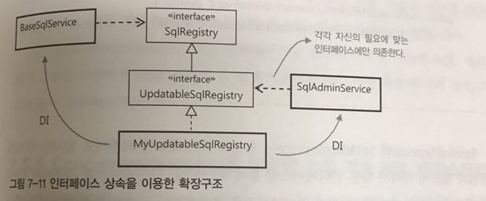

## 7.4 인터페이스 상속을 통한 안전한 기능확장
- 인터페이스는 한 오브젝트를 바라보는 창이라고 할 수 있으며 하나의 오브젝트를 바라보는 창이 여러가지일 수 있다.
- 인터페이스 분리 원칙(Interface Segregation Principle): 오브젝트가 그 자체로 충분히 응집도가 높은 작은 단위로 설계됐더라도, 목적과 관심이 각기 다른 클라이언트가 있다면 인터페이스를 통해 적절히 분리해주어야 한다.
- 지금은 SqlRegistry 인터페이스를 통해 BaseSqlService가 MySqlRegistry를 이용하고 있다. 근데 MySqlRegistry는 BaseSqlService에 영향을 안주고 확장이 가능하다.
- 예로 SQL update를 위한 기능을 추가한다고 가정해볼 때 다음과 같이 클라이언트는 각자 필요한 인터페이스 레이어에서 인터페이스를 호출하여 사용하면 된다.

```
package springbook.issuetracker.sqlservice;
...
public interface UpdatableSqlRegistry extends SqlRegistry {
	public void updateSql(String key, String sql) throws SqlUpdateFailureException;
	public void updateSql(Map<String, String> sqlmap) throws SqlUpdateFailureException;
}
```
```
<bean id="sqlService" class="springbook.user.sqlservice.BaseSqlService">
	...
	<property name="sqlRegistry" ref="sqlRegistry" />
</bean>

<bean id="sqlRegistry" class="springbook.user.sqlservice.MyUpdatableSqlRegistry" />

<bean id="sqlAdminService" class="springbook.user.sqlservice.SqlAdminService" />
	<property name="updatableSqlRegistry" ref="sqlRegistry" />
	...
</bean>
```
```
public class SqlAdminService implements AdminEventListener {
	private UpdatableSqlRegistry updatableSqlRegistry;

	public void setUpdatableSqlRegistry(UpdatableSqlRegistry updatableSqlRegistry) {
		this.updatableSqlRegistry = updatableSqlRegistry;
	}

	public void updateEventListener(UpdateEvent event) {
		this.updatableSqlRegistry.updateSql(event.get(KEY_ID), event.get(SQL_ID));
	}
}
```
