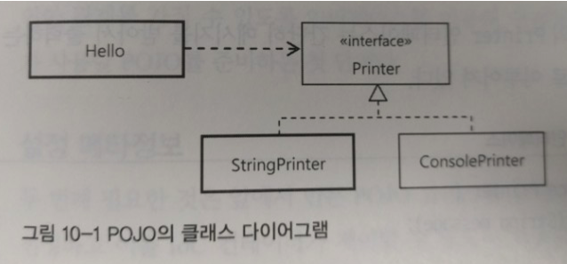
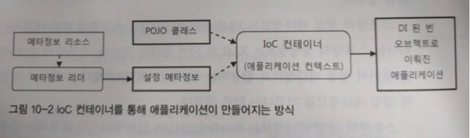
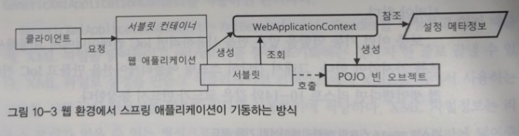
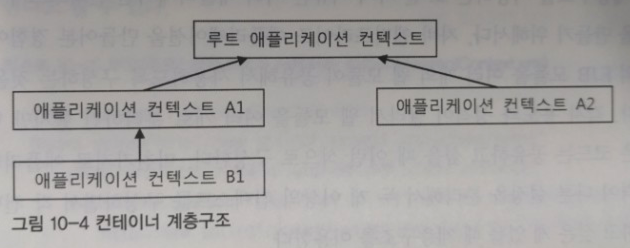
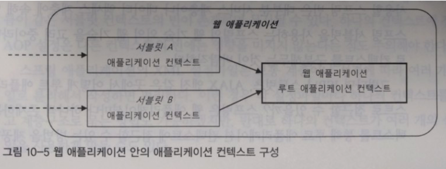
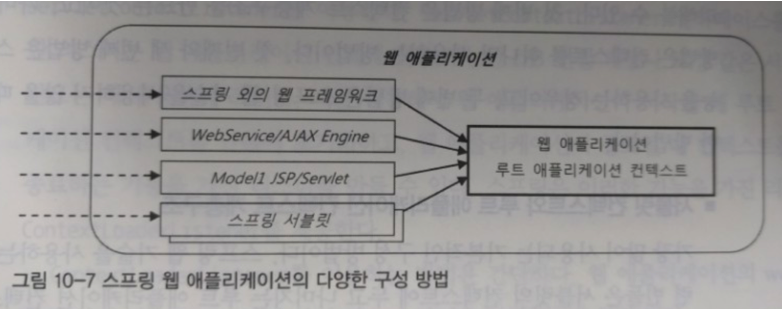

- 10장에서는 스프링이 제공하는 DI 설정 메타데이터를 다루는 여러 가지 방법을 살펴보고 상황에 맞게 어떤 설정 방식과 응용 기술을 선택할지에 대해 알아보자.

# IoC 컨테이너: 빈 팩토리와 애플리케이션 컨텍스트
- 스프링 애플리케이션에서는 오브젝트의 생성과 관계설정, 사용, 제거 등의 작업을 애플리케이션 코드 대신 독립된 `컨테이너`가 담당하는데, 컨테이너가 코드 대신 오브젝트에 대한 제어권을 갖고 있다고 해서 `IoC` 라고 부른다. 그래서 스프링 컨테이너를 `IoC 컨테이너` 라고 부른다.
- `IoC`를 담당하는 컨테이너를 `빈 팩토리` 또는 `애플리케이션 컨텍스트`라고 부르며, `오브젝트 사이의 런타임 관계를 설정하는 DI` 관점에서는 컨테이너를 `빈 팩토리`라고 한다.
- 스프링 컨테이너는 단순한 DI외에도 엔터프라이즈에 필요한 기능을 추가해서 `애플리케이션 컨텍스트`라고 부른다. 즉 `애플리케이션 컨텍스`트는 그 자체로 `IoC`와 `DI`를 위한 빈 팩토리이면서 그 이상의 기능을 가진것이다.
- 빈 팩토리와 애플리케이션 컨텍스트는 각각 `BeanFactory`와 `ApplicationContext` 두 개의 인터페이스로 정의되어 있는데, `ApllicationContext`는 `BeanFactory`의 인터페이스를 상속하고 있다.
- 스프링 애플리케이션은 최소 하나 이상의 `IoC 컨테이너`를 갖고 있다.

## IoC 컨테이너를 이용해 애플리케이션 만들기
- IoC 컨테이너를 사용하는 애플리케이션을 만드는 방법과 그 동작 원리를 먼저 살펴보자.
- 가장 간단하게 IoC 컨테이너를 만드는 방법은 ApplicationContext 구현 클래스의 인스턴스를 만드는 것이다.

```java
StaticApplicationContext ac = new StaticApplicationContext();
```

- 이렇게 만들어진 IoC 컨테이너가 본격적으로 동작하려면 `POJO 클래스`와 `설정 메타 정보`가 필요하다.

### POJO 클래스
- 먼저 애플리케이션의 핵심 코드를 담고 있는 POJO 클래스를 준비해야 한다.
- POJO 는 특정 기술과 스펙에서 독립적일 뿐더러 의존관계에 있는 다른 POJO와 느슨한 결합을 갖도록 만들어야 한다. (늘 그랫듯 인터페이스를 통해..)



```java
public class Hello {
    String name;
    Printer printer;

    public String sayHello() {
        return "Hello " + name; //프로퍼티로 DI받은 이름을 이용ㅇ해 간단한 인사문구 만들기
    }

    public void print() {
        this.printer.print(sayHello());
        //DI에 의해 의존 오브젝트로 제공받은 Printer 에게 출력 작업을 위임한다.
    }

    public void setName(String name) {
        this.name = name;
        //DI 로 name 을 주입받는다.
    }

    public void setPrinter(Printer printer) {
        this.printer = printer;
        //Printer 인터페이스를 구현한 오브젝트를 주입받는다.
    }
}
```

```java
public interface Printer {
    void print(String message);
}
```

```java
//Printer 인터페이스를 구현한 클래스..
public class StringPrinter implements Printer {
    private StringBuffer buffer = new StringBuffer();

    public void print(String message) {
        this.buffer.append(message);
    }

    public String toString() {
        return this.buffer.toString();
    }
}
```

```java
//Printer 인터페이스를 구현한 또다른 클래스..
public class ConsolePrinter implements Printer {
    private StringBuffer buffer = new StringBuffer();

    public void print(String message) {
        System.out.println(message);
    }
}
```
- 각자 기능에 충실하게 독립된 POJO 클래스를 만들고 결합도가 낮은 유영한 관계를 ㄹ가질 수 있도록 인터페이스를 이용해 연결해주는 것 까지가 IoC 컨테이너가 사용할 POJO를 만드는 첫 단계다.

### 설정 메타정보
- 두번째 필요한 것은 POJO 클래스들 중 애플리케이션에서 실제 사용할 것을 선정하고 이를 IoC 컨테이너가 제어할 수 있도록 적절한 메타정보를 만들어 제공하는 작업이다.
- IoC 컨테이너의 가장 기초적인 역할은 `빈(Bean)` 이라고 부르는 오브젝트를 생성하고 관리하는 것이고 설정 메타정보는 이 빈을 어떻게 만들고 어떻게 동작하게 할 것인가에 관한 정보이다.
- 설정 메타정보는 BeanDefinition 인터페이스로 표현되는 순수한 표현 정보로 어느 포맷이든 BeanDefinitionReader로 변환해줄 수 있다.
- 빈 메타정보는 대략 다음과 같다.
    - 빈 아이디, 이름, 별칭: 빈 오브젝트를 구분할 수 있는 식별자
    - 클래스 또는 클래스 이름: 빈으로 만들 POJO 클래스 또는 서비스 클래스 정보
    - 스코프: 싱글톤, 프로토타입과 같은 빈의 생성 방식과 존재 범위
    - 프로퍼티 값 또는 참조: DI에 사용할 프로퍼티 이름과 값 또는 참조하는 빈의 이름
    - 생성자 파라미터 값 또는 참조: DI에 사용할 생성자 파라미터 이름과 값 또는 참조할 빈의 이름
    - 지연된 로딩 여부, 우선 빈 여부, 자동와이어링 여부, 부모 빈 정보, 빈팩토리 이름 등
- 스프링 IoC 컨테이너는 설정 메타정보를 읽어들인 뒤 빈 오브젝트를 생성하고 DI를 수행한다.


- **결국 스프링 애플리케이션이란 POJO 클래스와 설정 메타정보를 이용해 IoC 컨테이너가 만들어주는 오브젝트의 조합이라고 할 수 있다.**-

## IoC 컨테이너 종류와 사용 방법
- 스프링 애플리케이션에서는 직접 코드를 통해 ApplicationContext 오브젝트를 생성하는 경우는 거의 없고 대부분 간단한 설정으로 ApplicationContext 가 자동으로 만들어지는 방법을 사용한다. 자동 생성 방법을 살펴보자.

### StaticApplicationContext
- StaticApplicationContext는 코드를 통해 빈 메타정보를 등록하기 위해 사용하지만 학습 테스트를 만들 때를 제외하면 사용되지 않으며 실전에서는 사용하면 안된다.

### GenericApplicationContext
- GenericApplicationContext 는 가장 일반적인 애플리케이션 컨텍스트의 구현 클래스로 실전에서 사용될 수 있는 모든 기능을 갖추고 있다.
- 빈 설정 리더를 만들기만 하면 어떤 형태로도 빈 설정 메타정보를 작성할 수 있는데 주로 XML파일, 애노테이션, 자바 클래스 세가지 방식으로 빈 설정 메타정보를 작성한다.
- GenericApplicationContext 는 실제로는 거의 사용되지 않고 JUnit 에서 내부적으로 사용된다.

### GenericXmlApplicationContext
- 코드에서 GenericApplicationContext 를 사용하는 경우 XmlBeanDefinitionReader를 직접 만들지 말고, 이 두개의 클래스가 결합된 GenericXmlApplicationContext 를 사용하면 편리하다.

### WebApplicationContext
- 스프링 애플리케이션에서 가장 많이 사용되는 애플리케이션 컨텍스트는 바로 WebApplicationContext다. 이름대로 웹 환경에서 필요한 기능이 추가된 애플리케이션 컨텍스트이다.
- 가장 많이 사용되는건, XmlWebApplicationContext 이고 기본값이다.
- WebApplicationContext 의 사용방법을 이해하려면 스프링의 IoC컨테이너를 적용했을 때, 애플리케이션을 기동시키는 방법에 대해 살펴볼 필요가 있다.
    - 스프링 IoC컨테이너는 빈 설정 메타정보를 이용해 빈 오브젝트를 만들고 DI작업을 수행한다.
    - 애플리케이션이 동작하려면 적어도 한번은 IoC컨테이너에게 요청해 빈 오브젝트를 가져와야 한다.
    - 웹 환경에서는 main() 메소드대신 서블릿 컨테이너가 브라우저로부터 오는 HTTP 요청을 받아서 해당 요청에 매핑된 서블릿을 실행해주는 방식으로 동작한다.


- 다행히 스프링은 애플리케이션 컨텍스트를 생성하고 설정 메타 정보로 초기화해주고, 클라이언트로부터 들어오는 요청마다 적절한 빈을 찾아서 이를 실행해주는 기능을 가진 DispatcherServlet 이라는 이름의 서블릿을 제공한다.
- 스프링이 제공해주는 서블릿을 web.xml 에 등록하는 것만으로 웹 환경에서 스프링 컨테이너가 만들어지고 애플리케이션을 실행하는데 필요한 대부분의 준비는 끝이다.

## IoC 컨테이너 계층구조
- 빈을 담아둘 IoC 컨테이너는 애플리케이션마다 하나면 충분하지만 하나 이상을 둘 때는 계층 구조를 만들때다.

### 부모 컨텍스트를 이용한 계층구조 효과
- 모든 애플리케이션 컨텍스트는 부모를 가질 수 있어 이를 이용해 트리구조의 계층을 만들 수 있다.

- 각자 독립적으로 자신이 관리하는 빈을 갖지만, DI를 위해 빈을 찾을 때는 부모의 빈까지 모두 검색한다.
- 중요한건 자신과 부모만 찾으며 자식이나 형제에서는 찾지 않는다는 점이다.
- 이렇게 트리구조로 만드는 이유는, 기존 설정을 수정하지 않고 일부 빈 구성을 바꾸거나, 여러 어플리케이션 컨텍스트에서 공유하는 설정을 만들기 위해서이다.
- AOP처럼 컨텍스트 안의 많은 빈에 일괄적으로 적용되는 기능은 대부분 해당 컨텍스트로 제한된다는 점도 주의해야 한다.

## 웹 애플리케이션의 IoC 컨테이너 구성
- 서버에서 동작하는 애플리케이션에서 스프링 IoC컨테이너를 사용하는 방법은 크게 세 가지로 구분할 수 있다. 먼저 웹 애플리케이션 안에 WebApplicationContext 타입의 IoC 컨테이너를 두는 방법을 알아보자.
- 웹 애플리케이션은 여러개의 서블릿을 가질 수 있지만, 최근엔 많은 웹 요청을 한번에 받을 수 있는 대표 서블릿을 등록해 공통적인 선행 작업을 수행하고 각 요청의 기능을 담당하는 핸들러라고 불리는 클래스를 호출하는 `프론트 컨트롤러 패턴` 방식을 많이 사용한다.
- 웹 애플리케이션 안에서 동작하는 IoC 컨테이너는, 서블릿과 웹 애플리케이션 레벨에서 만들어질 수 있는데 그래서 보통 두 개의 컨테이너 즉 WebApplicationContext 가 만들어진다.

### 웹 애플리케이션의 컨텍스트 계층 구조
- 웹 어플리케이션 레벨에 등록되는 컨테이너는 보통 루트 웹 어플리케이션 컨텍스트라고 불리며 서블릿 레벨 컨테이너의 부모가 된다.

- 이렇게 두 개 이상의 서블릿을 구분해서 등록할 필요가 있을까? 사실 이런 경우는 많지 않고 보통 아래와 같이 사용한다.

- 이렇게 계층 구조로 만드는 까닭은 웹 기술에 의존적인 부분과 그렇지 않은 부분을 구분하기 위함이다.
- 프레제테이션 계층을 분리해서 계층 구조로 애플리케이션 컨텍스트를 구성해두면 언제든지 간단한 웹 기술을 확장하거나 변경 조합해서 사용할 수 있으므로 당장 필요하지 않아도 이렇게 구성하는 것을 권장한다.


### 웹 애플리케이션의 컨텍스트 구성 방법
- 웹 어플리케이션 컨텍스트를 구성하는 방법은 세 가지를 고려해볼 수 있다.
    - 서블릿 컨텍스트와 루트 애플리케이션 컨텍스트 계층구조: 가장 많이 사용되는 기본 구성방법이다.
    - 루트 애플리케이션 컨텍스트 단일구조: 스프링 웹 기술을 사용하지 않을 경우 서블릿 애플리케이션 컨텍스트도 사용하지 않으므로 루트만 등록해주면 된다.
    - 서블릿 컨텍스트 단일구조: 서블릿에서 만들어지는 컨텍스트에 모든 빈을 다 등록하는 방식으로 단순한 설정을 선호한다면 선택할 수 있다.

### 루트 애플리케이션 컨텍스트 등록
- 웹 어플리케이션 레벨에 만들어지는 루트 웹 애플리케이션 컨텍스트를 등록하는 가장 간단한 방법은 서블릿의 이벤트 리스너를 이용하는 것이다.
- 스프링이 제공하는 ContextLoaderListener는 아래와 같이 web.xml 안에 리스너 선언을 넣어주면 된다.

```xml
<listener>
    <listener-class>org.springframework.web.context.ContextLoaderListener</listener-class>
</listener>
```
- 별다른 파라미터를 지정하지 않으면 디폴트로 설정된 다음의 값이 적용된다.
    - 애플리케이션 컨텍스트 클래스: XmlWebApplicationContext
    - XML 설정 파일 위치: /WEB-INF/applicationContext.xml
- 이 기본값은 `contextConfigLocation`과 `contextClass` 라는 `param-name`으로 각각의 설정을 변경해줄 수 있다.

### 서블릿 애플리케이션 컨텍스트 등록
- 스프링의 웹 기능을 지원하는 프론터 컨트롤러 서블릿은 DispatcherServlet 이다.
- 서블릿 애플리케이션 컨텍스트를 등록하는 방법은 루트 컨텍스트와 마찬가지로 간단히 web.xml 에 아래와 같이 선언해주기만 하면 된다.

```xml
<servlet>
    <servlet-name>spring</servlet-name>
    <servlet-class>org.springframework.web.servlet.DispatcherServlet</servlet-class>
    <load-on-startup>1</load-on-startup>
</servlet>
```
- servlet-name 으로 독립적인 네임스페이스를 지정하게 되며 컨텍스트를 구분하는 키가 된다. 네임스페이스는 이 이름에 `-servlet` 을 붙여 만들게 되고 이 네임스페이스를 기준으로 기본으로 사용한 XML 설정 파일 위치를 추정하게 된다.
```
'/WEB-INF/' + 서블릿네임스페이스 + '.xml'
```
- load-on-startup 으로 0 이상의 값을 넣으면 웹 애플리케이션이 시작되는 시점에서 서블릿을 로딩하고 초기화한다. 보통은 가장한 빨리 초기화가 진행되는 것이 바람직하므로 보통 1을 넣는다.
